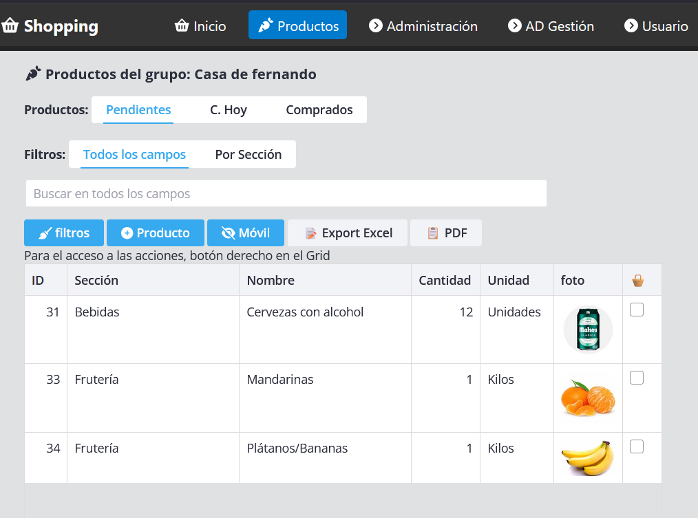
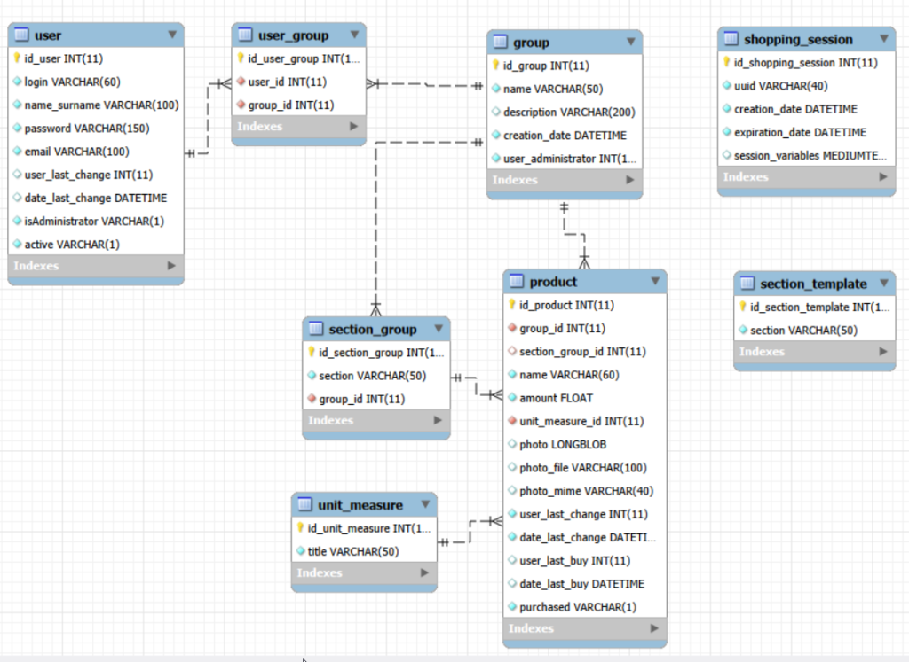

# svelte5-example-shopping

###### Desarrollo COMPLETO Svelte5 Aplicación Shopping



Es una aplicación completa, Front-End en **Svelte 5** y Back-End en **PHP SLIM 4**. 

He mejorado en mi codificación, en ambas plataformas, y el resultado es más legible, mantenible  y sencillo.

La APP es la misma que hice en [PHPRunner](https://fhumanes.com/blog/otros-ejemplos/crear-una-app-web/), después la hice en [REACT](https://fhumanes.com/blog/react/tutorial-de-react-comparacion-con-phprunner/) y ahora está hecha en Svelte 5.  
Me gusta utilizar este ejemplo por:

- Está orientada a que funcione en el Móvil y en el PC.
- Tiene gestión de usuarios y de roles.
- Maneja ficheros (imágenes), texto, password, números, fechas, check, etc. Gestiona **GRID** y **FORMS**.
- Controla las sesiones en el server y estas sesiones tienen un tiempo de caducidad, por no utilización de la aplicación.
- El modelo de datos es sencillo.
- Y la gestión de la aplicación, que no es relevante en el ejercicio, es muy simple y facilita la compresión rápida para su uso.

En el ejemplo he utilizado las guías anteriores de Svelte 5, salvo la de multi-idioma, porque no quise que tuviera más complejidad y así facilitar su entendimiento.

Como se ha indicado en las Guías, he utilizado los componentes de **[SVAR](https://svar.dev/)**.
 Son un poco complejos de entender, pero una vez que entiendes cómo 
funcionan, son muy potentes y sencillos de utilizar. He intentado que 
todo el desarrollo sea con los componentes, totalmente Free, de SVAR, 
que son un equipo estupendo, que facilitan buen soporte y que son de la 
U.E., en concreto de Polonia.

### Objetivo

Disponer de un ejemplo completo en Svelte 5 y PHP SLIM, con la 
utilización de las guías publicadas, que sirva como base para las 
personas que deseen incorporarse al desarrollo de aplicaciones en Svelte5.

**DEMO**:  https://fhumanes.com/my-shopping

Están los usuarios **admin/admin** y **usuario/usuario**.

Ruego que no destruyáis los ejemplos para que otros puedan utilizarlos y os propongo que os registréis para tener un «ambiente» particular para  vosotros. En el email, podéis utilizar el vuestro o poner uno ficticio. 

Si es el vuestro recibiréis un email, para que veáis que se puede hacer 
«TODO», desde la parte del server.

### Solución Técnica

Los productos, todos ellos Free, que he utilizado son:

- [**MySQL WorkBench**](https://www.mysql.com/products/workbench/)– Para hacer el **diseño de datos** y para **gestionar la información** en la Base de datos.
- [**NetBean for PHP**](https://netbeans.apache.org/tutorial/main/kb/docs/php/quickstart/). Para hacer el **desarrollo del Back-End.**
- [**Microsoft Visual Studio Code**](https://code.visualstudio.com/). Para hacer el **desarrollo del Front-End**.

Se puede utiliza el IDE de Microsoft para todo el desarrollo, pero estos son mis gustos y así los he utilizado.

En el IDE de Microsoft se integra **Copilot**, su **IA**. Ahora, es de gran ayuda, te soluciona muchos problemas y te genera  bastante código. No obstante, hay que conocer el entorno, pues aunque ha mejorado mucho, se sigue equivocando y tienes que «corregirlo».

Empecé el desarrollo en el orden que he indicado los productos.  Primero hice el modelo de datos y después hice el desarrollo del  Back-End, en SLIM PHP. Cuando tenía estas 2 partes, ya inicie el  desarrollo. Esto no significa que no haya habido correcciones o ajustes  (no muchos porque ya había hecho el desarrollo con otros productos). No  ha habido muchas correcciones, pero el que existan correcciones no es 
ningún problema, siempre que no tengas que cambiar la arquitectura  técnica de la solución.

### Modelo de datos



En «**shopping_session**» se mantiene los datos del usuario y los específicos de la sesión, por lo que esta arquitectura, además de segura y altamente potente, se podrían poner múltiples máquinas para gestionar la aplicación del Back-End. Teniendo en cuenta que la aplicación de  Front-End es JavaScript y utiliza exclusivamente los recursos de los usuarios conectados, a nivel de recursos necesarios para la puesta en Producción es muy baja, lo que define una arquitectura muy escalabre y  pocos recursos necesarios.

He utilizado intensamente la integridad referencial y la normalización de los datos. Yo lo recomiendo como os expliqué en el [tutorial](https://fhumanes.com/blog/otros-ejemplos/tutorial-curso-basico-de-phprunner/) de PHPRunner. Creo que al final, casi todo son ventajas.

## Aplicación de Back-End

Como os he indicado, está desarrollada en **PHP** y el **micro Framework de SLIM 4**. Es bastante sencillo de construcción, en este caso, sin unirse a  PHPRunner y lo mejor, es que funciona en cualquier hosting barato, lo  que permite ponerlo en Producción con unos costes mínimos.

He mantenido la estructura general que he utilizado hasta ahora, pero he mejorado en la estructura del código, lo que hace que sea más  sencillo de entender y, desde mi punto de vista, construirlo. Os voy a  mostrar un conjunto de ficheros para que veáis la sencillez.

<details>
<summary>include/Config.php</summary>

```php
<?php

// URL de ejecución de la aplicación
define('SCRIPTS_DIR', '/shopping-server/v1'); 

// Tiempo de sesión
define('TIME_OUT','+30 minutes');

$server = 'test';  // 'test' or 'production'
// Configuración del entorno de Desarrollo "test" o de Producción
if ($server == 'test' ) {
// Path root of Directory files in File System or Disc
define('DB_HOST', 'localhost');
define('DB_USER', 'root');
define('DB_PASSWORD', 'XXXXXXXXX'); 
define('DB_NAME', 'shopping');
// Config PHPMailer
define('EMAIL_HOST', 'smtp.hostinger.com');
define('EMAIL_USER', 'info@fhumanes.com');
define('EMAIL_PASSWORD', 'XXXXXXXXX');
define('EMAIL_PORT', 465);

} else {
// In Server Linux
define('DB_HOST', 'localhost');
define('DB_USER', 'u637977917_admin' );
define('DB_PASSWORD', 'XXXXXXXXXXXXXX'); 
define('DB_NAME', 'u637977917_shopping'); 
// Config PHPMailer
define('EMAIL_HOST', 'smtp.hostinger.com');
define('EMAIL_USER', 'info@fhumanes.com');
define('EMAIL_PASSWORD', 'XXXXXXXXXX');
define('EMAIL_PORT', 465);
} 

//referencia generado con MD5(uniqueid(<some_string>, true))
define('API_KEY','61437cfc-caa5-4cf9-9bee-85fe47efb09a');

/**
* API Response HTTP CODE
* Used as reference for API REST Response Header
*
* 
* 
// Error messages to facilitate their translation
$errorMessages = array(
    "001" => "Falta Token de Autorización o ha expirado",
    "002" => "El Token de autorización es incorrecto",
    "003" => "Campo(s) Requerido(s) o atributo(s) {1} faltan o están vacíos",
    "004" => "Usuario o Password no válida",
    "005" => "Usuario identificado correctamente",
    "006" => "Sesión ha expirado",
    "007" => "Falta Sesión de usuario",
    "008" => "Sesión borrada correctamente",
    "009" => "Ya existe usuario con el mismo Login o Email",
    "010" => "Usuario dado de alta",
    "011" => "Grupo creado correctamente",
    "012" => "El nombre del Grupo está duplicado",
    "013" => "El Grupo ha sido actualizado",
    "014" => "No se ha actualizado el Grupo",
    "015" => "Grupo no encontrado o el usuario no es Administrador",
    "016" => "Grupo eliminado correctamente",
    "017" => "Usuario no está autorizado para hacer esta acción",
    "018" => "Usuario no existe o ya está en el Grupo",
    "019" => "Usuario ha sido añadido al Grupo",
    "020" => "Usuario asignado al grupo correctamente",
    "021" => "El Usuario ya existe en ese Grupo",
    "022" => "Usuario eliminado del grupo correctamente",
    "023" => "Sección creada correctamente",
    "024" => "La sección está duplicada",
    "025" => "Sección se ha actualizado correctamente",
    "026" => "Sección borrada correctamente",
    "027" => "No se ha podido borar la Sección",
    "028" => "Unidad de Medida creada correctamente",
    "029" => "La Unidad de Medida ya existe",
    "030" => "Unidad de Medida actualizada correctamente",
    "031" => "Ningún registro se ha modificado",
    "032" => "Unidad de Medida borrada correctamente",
    "033" => "Sección de la plantilla creada correctamente",
    "034" => "La Sección de la plantilla ya existe",
    "035" => "Sección de la plantilla actualizada correctamente",
    "036" => "Sección de la plantilla borrada correctamente",
    "037" => "Producto creado en el grupo correctamente",
    "038" => "Producto ya existe en el grupo",
    "039" => "Producto actualizado correctamente",
    "040" => "El Estado informado es incorrecto",
    "041" => "Producto se ha borrado correctamente",
    "042" => "No existe ningún usuario para este email",
    "043" => "Usuario creado correctamente",
    "044" => "Usuario no creado, login o email ya existen",
    "045" => "Usuario modificado correctamente",
    "046" => "Usuario borrado correctamente",
    "047" => "La antigua Password no corresponde o las nuevas Password son diferentes",
    "048" => "",
    "049" => "",
);
```

</details>
<details>
<summary>v1/index.php</summary>

```php
<?php
/**
 *
 * @About:      API Interface
 * @File:       index.php
 * @Date:       $Date:$ Sep 2025
 * @Version:    $Rev:$ 1.0
 * @Developer:  Federico Guzman || Modificado por Fernando Humanes para PHP 8.3
 **/

/* Los headers permiten acceso desde otro dominio (CORS) a nuestro REST API o desde un cliente remoto via HTTP
 * Removiendo las lineas header() limitamos el acceso a nuestro RESTfull API a el mismo dominio
 * Nótese los métodos permitidos en Access-Control-Allow-Methods. Esto nos permite limitar los métodos de consulta a nuestro RESTfull API
 * Mas información: https://developer.mozilla.org/en-US/docs/Web/HTTP/Access_control_CORS
 **/

// $dominioPermitido = "http://localhost:3000";

// header("Access-Control-Allow-Origin: $dominioPermitido"); // Para restringir desde dónde se pueden hacer peticines
header("Access-Control-Allow-Origin: *");
header("Access-Control-Allow-Headers: Content-Type, authorization, Authorization, token-user ");
// header("Access-Control-Allow-Headers: *");

header('Access-Control-Allow-Credentials: true');
header('Access-Control-Allow-Methods: PUT, GET, POST, DELETE, OPTIONS');
// header("Access-Control-Allow-Headers: X-Requested-With");
header('Content-Type: text/html; charset=utf-8');
header('Content-Type: multipart/form-data');
header('Content-Type: application/x-www-form-urlencoded');
header('Content-Type: application/json');
header('P3P: CP="IDC DSP COR CURa ADMa OUR IND PHY ONL COM STA"');

// session_cache_limiter(false);

include_once '../include/Config.php';       // Configuration Rest Api
include_once '../include/Function.php';     // Funciones generales

// require_once("../../include/dbcommon.php"); // DataBase PHPRunner

// Debug
$debugCode = false; // On | Off, de depuración y volcado en el fichero "error.log"
custom_error(1,"URL ejecutada: ".$_SERVER["REQUEST_URI"]);          // To debug
custom_error(2,"Método de petición: ".$_SERVER['REQUEST_METHOD']);  // to Debug
$body = $body = file_get_contents('php://input');
custom_error(3,"Body: ".$body);                                    // to Debug
//  custom_error(4,"Campos POST: ".print_r($_POST,true));               // to Debug
// $debugCode = false;

// use App\Models\Db;  // Utilizamos la conexión de PHPRunner
use Psr\Http\Message\ResponseInterface as Response;
use Psr\Http\Message\ServerRequestInterface as Request;
use Psr\Http\Server\RequestHandlerInterface as RequestHandler;
use Slim\Factory\AppFactory;

use Slim\Middleware\ErrorMiddleware;
// use DI\Container;
use Slim\Routing\RouteCollectorProxy;
use Slim\Middleware\BodyParsingMiddleware;


require_once __DIR__ . '/../libs/autoload.php';   // Library SLIM v4

$app = AppFactory::create();

$app->addRoutingMiddleware();
// $app->add(new BasePathMiddleware($app)); // No usar si se ejecuta en subdirectorio
$app->addErrorMiddleware(true, true, true);
$app->addBodyParsingMiddleware();


$app->setBasePath(SCRIPTS_DIR);             // Indica el directorio desde donde está trabajando
// $app->setBasePath('/shopping-server/v1');             // Indica el directorio desde donde está trabajando

require_once '../include/DbFunctions.php';
$db = new DbFunctions();

// Necesario para las peticiones "OPTIONS"
$app->options('/{routes:.+}', function (Request $request, Response $response) {
    return $response;
});

$app->post('/userRegister', function (Request $request, Response $response, $args) use ($db) {         // Register User
         return $db->registerUser($request, $response, $args);
    });
$app->post('/login', function (Request $request, Response $response, $args) use ($db) {         // Login
         return $db->login($request, $response, $args);
    });
$app->post('/logout', function (Request $request, Response $response, $args) use ($db) {        // Login
         return $db->logout($request, $response, $args);
    });

$app->get('/userInfo', function (Request $request, Response $response, $args) use ($db) {         // Info user
         return $db->userInfo($request, $response, $args);
    });
$app->put('/userUpdate', function (Request $request, Response $response, $args) use ($db) {       // Update user
         return $db->userUpdate($request, $response, $args);
    });
$app->put('/userPassword', function (Request $request, Response $response, $args) use ($db) {      // Change Password
         return $db->userPassword($request, $response, $args);
    });

// Grupo de Grupos (para los grupos en los que pertenece el Usuario) Habrá otro grupo para el Administrador
$app->group('/group', function (RouteCollectorProxy $group) use ($db) {
    $group->get('', function (Request $request, Response $response, $args) use ($db) {          // List User
         return $db->ListGroupUser($request, $response, $args);
    });
    $group->post('', function (Request $request, Response $response, $args) use ($db) {          // Add User
         return $db->AddGroupUser($request, $response, $args);
    });
    $group->put('/{id}', function (Request $request, Response $response, $args) use ($db) {      // Update User
         return $db->EditGroupUser($request, $response, $args);
    });
    $group->delete('/{id}', function (Request $request, Response $response, $args) use ($db) {   // Delete User
         return $db->DeleteGroupUser($request, $response, $args);
    });
});

// Grupo de Grupos  para el Administrador
$app->group('/groupAdmin', function (RouteCollectorProxy $group) use ($db) {
    $group->get('', function (Request $request, Response $response, $args) use ($db) {          // List User
         return $db->ListGroupAdmin($request, $response, $args);
    });
    $group->post('', function (Request $request, Response $response, $args) use ($db) {          // Add User
         return $db->AddGroupAdmin($request, $response, $args);
    });
    $group->put('/{id}', function (Request $request, Response $response, $args) use ($db) {      // Update User
         return $db->EditGroupAdmin($request, $response, $args);
    });
    $group->delete('/{id}', function (Request $request, Response $response, $args) use ($db) {   // Delete User
         return $db->DeleteGroupAdmin($request, $response, $args);
    });
});

// Grupo de Grupos (para los grupos en los que pertenece el Usuario) 
$app->group('/userGroup', function (RouteCollectorProxy $group) use ($db) {
    $group->get('/{group}', function (Request $request, Response $response, $args) use ($db) {          // List Group
         return $db->ListUserGroup($request, $response, $args);
    });
    $group->post('/{group}', function (Request $request, Response $response, $args) use ($db) {          // Add Group
         return $db->AddUserGroup($request, $response, $args);
    });
    /*
     $group->put('/{group}/{id}', function (Request $request, Response $response, $args) use ($db) {      // Update Group
         return $db->EditUserGroup($request, $response, $args);
    });
     */
    $group->delete('/{group}/{id}', function (Request $request, Response $response, $args) use ($db) {   // Delete Group
         return $db->DeleteUserGroup($request, $response, $args);
    });
});
// Grupo de Grupos (para la gestión de Secciones del grupo)
$app->group('/secctionGroup', function (RouteCollectorProxy $group) use ($db) {
    $group->get('/{group}', function (Request $request, Response $response, $args) use ($db) {          // List User
         return $db->ListSectionGroup($request, $response, $args);
    });
    $group->post('/{group}', function (Request $request, Response $response, $args) use ($db) {          // Add User
         return $db->AddSectionGroup($request, $response, $args);
    });
    $group->put('/{group}/{id}', function (Request $request, Response $response, $args) use ($db) {      // Update User
         return $db->EditSectionGroup($request, $response, $args);
    });
    $group->delete('/{group}/{id}', function (Request $request, Response $response, $args) use ($db) {   // Delete User
         return $db->DeleteSectionGroup($request, $response, $args);
    });
});

// Unit_measure Gestión de Unidades de Medida (LIST pública, resto necesario ADMIN
$app->group('/measure', function (RouteCollectorProxy $group) use ($db) {
    $group->get('', function (Request $request, Response $response, $args) use ($db) {          // List User
         return $db->ListMeasure($request, $response, $args);
    });
    $group->post('', function (Request $request, Response $response, $args) use ($db) {          // Add User
         return $db->AddMeasure($request, $response, $args);
    });
    $group->put('/{id}', function (Request $request, Response $response, $args) use ($db) {      // Update User
         return $db->EditMeasure($request, $response, $args);
    });
    $group->delete('/{id}', function (Request $request, Response $response, $args) use ($db) {   // Delete User
         return $db->DeleteMeasure($request, $response, $args);
    });
});

// SECTION_TEMPLATE - Plantilla de Secciones
$app->group('/sectionTemplate', function (RouteCollectorProxy $group) use ($db) {
    $group->get('', function (Request $request, Response $response, $args) use ($db) {          // List User
         return $db->ListSectionTemplate($request, $response, $args);
    });
    $group->post('', function (Request $request, Response $response, $args) use ($db) {          // Add User
         return $db->AddSectionTemplate($request, $response, $args);
    });
    $group->put('/{id}', function (Request $request, Response $response, $args) use ($db) {      // Update User
         return $db->EditSectionTemplate($request, $response, $args);
    });
    $group->delete('/{id}', function (Request $request, Response $response, $args) use ($db) {   // Delete User
         return $db->DeleteSectionTemplate($request, $response, $args);
    });
});

// PRODUCT - Productos de un Grupo
$app->group('/product', function (RouteCollectorProxy $group) use ($db) {
    $group->get('/{group}', function (Request $request, Response $response, $args) use ($db) {          // List Product
         return $db->ListProduct($request, $response, $args);
    });
    $group->post('/{group}', function (Request $request, Response $response, $args) use ($db) {          // Add Product
         return $db->AddProduct($request, $response, $args);
    });
    $group->put('/{group}/{id}', function (Request $request, Response $response, $args) use ($db) {      // Update Product
         return $db->EditProduct($request, $response, $args);
    });
    $group->put('/{group}/{id}/{state}', function (Request $request, Response $response, $args) use ($db) {      // Update Product
         return $db->EditProductState($request, $response, $args);
    });
    $group->delete('/{group}/{id}', function (Request $request, Response $response, $args) use ($db) {   // Delete Product
         return $db->DeleteProduct($request, $response, $args);
    });
});

// USER - Usuarios de la App
$app->group('/user', function (RouteCollectorProxy $group) use ($db) {
    $group->get('', function (Request $request, Response $response, $args) use ($db) {          // List User
         return $db->ListUser($request, $response, $args);
    });
    $group->get('/{email}', function (Request $request, Response $response, $args) use ($db) {   // List User X Email
         return $db->ListUserEmail($request, $response, $args);
    });
    $group->post('', function (Request $request, Response $response, $args) use ($db) {          // Add User
         return $db->AddUser($request, $response, $args);
    });
    $group->put('/{id}', function (Request $request, Response $response, $args) use ($db) {          // Update User
         return $db->EditUser($request, $response, $args);
    });
    $group->delete('/{id}', function (Request $request, Response $response, $args) use ($db) {       // Delete User
         return $db->DeleteUser($request, $response, $args);
    });
});


$app->run();
```

</details>
<details>
<summary>include/DbFunctions.php</summary>

```php
<?php

include_once __DIR__.'/Config.php';                 // Configuration Rest Api
include_once __DIR__.'/Function.php';               // General Function

require_once __DIR__.'/DBF_session.php';            // Funciones específicas según tablas
require_once __DIR__.'/DBF_identification.php';
require_once __DIR__.'/DBF_groupUser.php';
require_once __DIR__.'/DBF_groupSpecial.php';
require_once __DIR__.'/DBF_general.php';
require_once __DIR__.'/DBF_product.php';
require_once __DIR__.'/DBF_user.php';

/**
 *
 * @About:      Gestión de Compras
 * @File:       DbFunctions
 * @Date:       $Date:$ sep 2025
 * @Version:    $Rev:$ 1.0
 * @Developer:  fernando humanes
 **/

/*
    use Psr\Http\Message\ResponseInterface as Response;
    use Psr\Http\Message\ServerRequestInterface as Request;

    use PHPMailer\PHPMailer\PHPMailer;   // PHPMailer
    use PHPMailer\PHPMailer\SMTP;
    use PHPMailer\PHPMailer\Exception;
 */   

class DbFunctions
{

    private $db;

    function __construct()
    {
        $dbHost = DB_HOST;
        $dbName = DB_NAME;

        $dsn = "mysql:host=$dbHost;dbname=$dbName;charset=utf8mb4";
        $options = [
            PDO::ATTR_ERRMODE            => PDO::ERRMODE_EXCEPTION,
            PDO::ATTR_DEFAULT_FETCH_MODE => PDO::FETCH_ASSOC,
            PDO::ATTR_EMULATE_PREPARES   => false,
        ];
        try {
            $pdo = new PDO($dsn, DB_USER, DB_PASSWORD, $options);
            $this->db = $pdo;
        } catch (PDOException $e) {
            custom_error(1000,"Error en DbFunction: ".print_r($e, true));  // to Debug
            throw new PDOException($e->getMessage(), (int)$e->getCode());
        }

    }

     use Identification;              // Grupo de funcionaes de identificacion   
     use Session;                     // Grupo de funcionaes de Gestión de la Sesión "particular" del sistema
     use GroupUser;                   // Grupo de Grupos del usuario Conectado.
     use GroupSpecial;                // Grupo de Entidades especiales del Grupo.
     use General;                     // Información sin argupación específica
     use Product;                     // Grupo de funciones sobre Productos
     use User;                        // Grupo de funciones sobre Usuarios
}
```

</details>
<details>
<summary>include/DBF_Identification.php</summary>

```php
<?php

    use Psr\Http\Message\ServerRequestInterface as Request;
    use Psr\Http\Message\ResponseInterface as Response;

    use PHPMailer\PHPMailer\PHPMailer;   // phpmAILER
    use PHPMailer\PHPMailer\SMTP;
    use PHPMailer\PHPMailer\Exception;

trait Identification {

    /*
     * ADD nuevo usuario desde registro
     */
    public function registerUser(Request $request, Response $response )
    {
        global $errorMessages;
        // Verificación Token de Authorization
        $verify = authenticate($request, $response); 
        if ($verify['error'] == true ){ // Se ha encontrado error en la verificación
            $response->getBody()->write(json_encode(["message"=> $verify['message']]));
            return $response
                ->withHeader('content-type', 'application/json')
                ->withStatus($verify['error_status']);   
        }

        $param = $request->getParsedBody();          // Obtener los datos del JSON
        // Verificación de que están todos los campos
        $verify = verifyRequiredParams(array('login', 'email', 'nombre', 'password'), $param);
        if ($verify['error'] == true ){ // Se ha encontrado error en la verificación
            $response->getBody()->write(json_encode(["message"=> $verify['message']]));
            return $response
                ->withHeader('content-type', 'application/json')
                ->withStatus($verify['error_status']);   
        }
        $email = $param['email'];
        $login = $param['login'];
        $stmt = $this->db->prepare("SELECT * FROM user WHERE email = :email or login = :login ");
        if (!$stmt->execute([':email' => $email ,':login' => $login])) {
            $error = $stmt->errorInfo();
            $response->getBody()->write(json_encode(["message"=> $error]));
            return $response
                ->withHeader('content-type', 'application/json')
                ->withStatus(500);
        }
        $data = $stmt->fetch(PDO::FETCH_ASSOC);

        if (is_array($data)) {
            // Ya existe otro usuario con ese mismo email
           $response->getBody()->write(json_encode(["message"=> $errorMessages['009']]));
            return $response
                ->withHeader('content-type', 'application/json')
                ->withStatus(401);
        }

        $now = date('Y-m-d H:i:s');         // Fecha actual
        $stmt = $this->db->prepare("INSERT INTO user (login, name_surname, password, email, date_last_change, isAdministrator, active)
                VALUES (:login,:name,:password,:email,'$now','0','1') ");
        $stmt->execute([':login' => $param['login'] ,':name' => $param['nombre'],
                        ':password'=>md5($param['password']),':email'=>$param['email']]);


        $this->sendEmail('info@fhumanes.com', [['email'=>$email,'name'=>$param['nombre']]], 
                [['email'=>'info@fhumanes.com','name'=>'Info']] ,
                'Solicitada el alta en la APP Shopping',
                '<p> Se ha solicitado y dado de alta un usuario con este email en la APP Shopping </p>'); // Mensaje de email de prueba

        $response->getBody()->write(json_encode(["message"=> $errorMessages['010']]));
         return $response
             ->withHeader('content-type', 'application/json')
             ->withStatus(200);
    }
    /*
    * Login del usuario
    */
    public function login(Request $request, Response $response )
    {
        global $errorMessages;
        // Verificación Token de Authorization
        $verify = authenticate($request, $response); 
        if ($verify['error'] == true ){ // Se ha encontrado error en la verificación
            $response->getBody()->write(json_encode(["message"=> $verify['message']]));
            return $response
                ->withHeader('content-type', 'application/json')
                ->withStatus($verify['error_status']);   
        }

        $param = $request->getParsedBody();          // Obtener los datos del JSON
        // Verificación de que están todos los campos
        $verify = verifyRequiredParams(array('login', 'password'), $param);
        if ($verify['error'] == true ){ // Se ha encontrado error en la verificación
            $response->getBody()->write(json_encode(["message"=> $verify['message']]));
            return $response
                ->withHeader('content-type', 'application/json')
                ->withStatus($verify['error_status']);   
        }

        $verify = $this->createSession($request, $response);    // Crea la sesión

        $error_status = $verify['error_status'];
        unset($verify['error_status']);             // se borraran las variables que no se desean enviar
        unset($verify['message_num']); 
        unset($verify['error']);
        $response->getBody()->write(json_encode($verify));
            return $response
                ->withHeader('content-type', 'application/json')
                ->withStatus($error_status);   
        }

    /*
    * Logout del usuario
    */
    public function logout(Request $request, Response $response )
    {
        global $errorMessages;

        // Verificación Token de Usuario
        $verify = $this->controlSession($request, $response); 
        if ($verify['error'] == true ){ // Se ha encontrado error en la verificación
            $response->getBody()->write(json_encode(["message"=> $verify['message']]));
            return $response
                ->withHeader('content-type', 'application/json')
                ->withStatus($verify['error_status']);   
        }

        $param = array();
        $param['uuid'] = $verify['token-user']; 
        $verify = $this->deleteSession($request,$response, $param);         // Eliminación de la sessión

        if ($verify['error'] == true ){ // Se ha encontrado error en la verificación
            $response->getBody()->write(json_encode(["message"=> $verify['message']]));
            return $response
                ->withHeader('content-type', 'application/json')
                ->withStatus($verify['error_status']);   
        }
        $response->getBody()->write(json_encode(["message"=> $errorMessages['008']]));  // OK, Se ha hecho Logout
            return $response
                ->withHeader('content-type', 'application/json')
                ->withStatus(200); 
        }

    // Acceso a la información de un Usuario
    public function userInfo(Request $request, Response $response, $args)   
    {   
        global $errorMessages;
        // Verificación Token de Usuario
        $verify = $this->controlSession($request, $response); 
        if ($verify['error'] == true ){ // Se ha encontrado error en la verificación
            $response->getBody()->write(json_encode(["message"=> $verify['message']]));
            return $response
                ->withHeader('content-type', 'application/json')
                ->withStatus($verify['error_status']);   
        }
        $uuid = $verify['token-user']; 
        $session = $this->openSession($uuid);           // Recuperación datos usuario conectado
        $dataUser = $session['dataUser'];

        $id_user = $dataUser['id_user'];
        $is_administrator = $dataUser['isAdministrator'];

        // Obtener los datos del Usuario conectado
        $stmt = $this->db->prepare("SELECT u1.id_user, u1.login, ".
        " u1.name_surname, u1.email, u1.user_last_change, u2.name_surname user_last_change_text, ".
  " u1.date_last_change, u1.isAdministrator, u1.active ".
        " FROM user u1 ".
        " LEFT JOIN user u2 on ( u1.user_last_change = u2.id_user ) ".
        " WHERE u1.id_user =:id_user");
        // Parámetrtos
        $stmt->bindParam(':id_user', $id_user);     
        // Ejecutar y obtener resultados
        $stmt->execute();
        $data = $stmt->fetchAll(PDO::FETCH_ASSOC); // Recupera todos los registros

        $response->getBody()->write(json_encode(['data'=>$data]));
         return $response
             ->withHeader('content-type', 'application/json')
             ->withStatus(200);

    }
    // EDIT de Usuarios
    public function userUpdate(Request $request, Response $response, $args)   
    {   
        global $errorMessages;
        // Verificación Token de Usuario
        $verify = $this->controlSession($request, $response); 
        if ($verify['error'] == true ){ // Se ha encontrado error en la verificación
            $response->getBody()->write(json_encode(["message"=> $verify['message']]));
            return $response
                ->withHeader('content-type', 'application/json')
                ->withStatus($verify['error_status']);   
        }
        $uuid = $verify['token-user']; 
        $session = $this->openSession($uuid);           // Recuperación datos usuario conectado
        $dataUser = $session['dataUser'];

        $id_user = $dataUser['id_user'];
        $is_administrator = $dataUser['isAdministrator'];

        // Verificación de que están todos los campos 
        // " login, name_surname,  email"
        // Todos los campos son obligatorios

        $param = $request->getParsedBody();          // Obtener los datos del JSON

        $verify = verifyRequiredParams(array('login', 'name_surname', 'email'), $param); 
        if ($verify['error'] == true ){ // Se ha encontrado error en la verificación
            $response->getBody()->write(json_encode(["message"=> $verify['message']]));
            return $response
                ->withHeader('content-type', 'application/json')
                ->withStatus($verify['error_status']);   
        }
        try {
            // UPDATE USER
            $now = date('Y-m-d H:i:s');         // Fecha actual
            // $password = md5($param['password']);

            $stmt = $this->db->prepare("UPDATE user SET ".
                    " login = :login, ".
                    " name_surname = :name_surname, ".
                    " email = :email,".
                    " user_last_change = :id_user,".
                    " date_last_change = :last_change ".
            "WHERE id_user = :id ");

            // Asignar el valor del parámetro
            $stmt->bindParam(':login', $param['login']);
            $stmt->bindParam(':name_surname', $param['name_surname']);
            $stmt->bindParam(':email', $param['email']);
            $stmt->bindParam(':id_user', $id_user);
            $stmt->bindParam(':last_change', $now);
            $stmt->bindParam(':id', $id_user);

            // Ejecutar y obtener resultados
            $stmt->execute();

            if ( $stmt->rowCount() == 0 ) { // No se ha actualizado ningún registro
                $response->getBody()->write(json_encode(['message'=>$errorMessages['031']]));
                return $response
                     ->withHeader('content-type', 'application/json')
                     ->withStatus(400);
            }

            $response->getBody()->write(json_encode(['message'=>$errorMessages['045']]));
             return $response
                 ->withHeader('content-type', 'application/json')
                 ->withStatus(200);
         } catch (PDOException $e) {
            $response->getBody()->write(json_encode(['message'=>$errorMessages['044']]));
             return $response
                 ->withHeader('content-type', 'application/json')
                 ->withStatus(400);
         }
    }

        // EDIT de Usuarios
    public function userPassword(Request $request, Response $response, $args)   
    {   
        global $errorMessages;
        // Verificación Token de Usuario
        $verify = $this->controlSession($request, $response); 
        if ($verify['error'] == true ){ // Se ha encontrado error en la verificación
            $response->getBody()->write(json_encode(["message"=> $verify['message']]));
            return $response
                ->withHeader('content-type', 'application/json')
                ->withStatus($verify['error_status']);   
        }
        $uuid = $verify['token-user']; 
        $session = $this->openSession($uuid);           // Recuperación datos usuario conectado
        $dataUser = $session['dataUser'];

        $id_user = $dataUser['id_user'];


        // Verificación de que están todos los campos 
        // " login, name_surname,  email"
        // Todos los campos son obligatorios

        $param = $request->getParsedBody();          // Obtener los datos del JSON

        $verify = verifyRequiredParams(array('passwordOld', 'passwordNew1', 'passwordNew2'), $param); 
        if ($verify['error'] == true ){ // Se ha encontrado error en la verificación
            $response->getBody()->write(json_encode(["message"=> $verify['message']]));
            return $response
                ->withHeader('content-type', 'application/json')
                ->withStatus($verify['error_status']);   
        }

        // Obtener los datos del ususario conectado"
        $stmt = $this->db->prepare("SELECT u1.id_user, u1.login, u1.password, ".
        " u1.name_surname, u1.email, u1.user_last_change, ".
  " u1.date_last_change, u1.isAdministrator, u1.active ".
        " FROM user u1 ".
        " WHERE u1.id_user =:id_user");
        // Parámetrtos
        $stmt->bindParam(':id_user', $id_user);     
        // Ejecutar y obtener resultados
        $stmt->execute();
        $userData = $stmt->fetchAll(PDO::FETCH_ASSOC); // Recupera todos los registros
        $userData = $userData[0]; // Recogemos el primer registro
        custom_error(400, "Registro recuperado: ".print_r($userData, true));
        $ConexPassword = $userData['password'];
        $passwordOldMd5 = MD5($param['passwordOld']);

        // Controles de verificación de Password
        if ( $ConexPassword <> $passwordOldMd5 OR $param['passwordNew1'] <> $param['passwordNew2'] ) {
                $response->getBody()->write(json_encode(['message'=>$errorMessages['047']]));
                return $response
                     ->withHeader('content-type', 'application/json')
                     ->withStatus(400);
            }

        try {
            // UPDATE USER
            $now = date('Y-m-d H:i:s');         // Fecha actual
            $password = md5($param['passwordNew1']);

            $stmt = $this->db->prepare("UPDATE user SET ".
                    " password = :password, ".
                    " user_last_change = :id_user,".
                    " date_last_change = :last_change ".
            "WHERE id_user = :id ");

            // Asignar el valor del parámetro
            $stmt->bindParam(':password', $password);
            $stmt->bindParam(':id_user', $id_user);
            $stmt->bindParam(':last_change', $now);
            $stmt->bindParam(':id', $id_user);

            // Ejecutar y obtener resultados
            $stmt->execute();

            if ( $stmt->rowCount() == 0 ) { // No se ha actualizado ningún registro
                $response->getBody()->write(json_encode(['message'=>$errorMessages['031']]));
                return $response
                     ->withHeader('content-type', 'application/json')
                     ->withStatus(400);
            }

            $response->getBody()->write(json_encode(['message'=>$errorMessages['045']]));
             return $response
                 ->withHeader('content-type', 'application/json')
                 ->withStatus(200);
         } catch (PDOException $e) {
            $response->getBody()->write(json_encode(['message'=>$e->getMessage()]));
             return $response
                 ->withHeader('content-type', 'application/json')
                 ->withStatus(400);
         }
    }


    private function sendEmail($from, $addressArray, $replyToArray , $subject, $body, $attachmentArray=array() )
        {
        // Validaciones de los parámetros de la función
        $validation = array();
        $validation[0] = validarFormatoArray($addressArray, ['email','name']);
        $validation[1] = validarFormatoArray($replyToArray, ['email','name']);
        $validation[2] = validarFormatoArray($attachmentArray, ['file','name']);
        if ($validation[0] == false || $validation[1] == false || $validation[1] == false )
        {
            return false;                   // Parámetros incorrectos
        }

        //Create an instance; passing `true` enables exceptions
        $mail = new PHPMailer(true);
        // $mail->SMTPDebug  = 2;      // En MODO DEBUG

        try {
            //Server settings
            // $mail->SMTPDebug = SMTP::DEBUG_SERVER;                      //Enable verbose debug output
            $mail->isSMTP();                                            //Send using SMTP
            $mail->Host       = EMAIL_HOST;                             //Set the SMTP server to send through
            $mail->SMTPAuth   = true;                                   //Enable SMTP authentication
            $mail->Username   = EMAIL_USER;                             //SMTP username
            $mail->Password   = EMAIL_PASSWORD;                         //SMTP password
            $mail->SMTPSecure = PHPMailer::ENCRYPTION_SMTPS;            //Enable implicit TLS encryption
            $mail->Port       = EMAIL_PORT;                             //TCP port to connect to; use 587 if you have set `SMTPSecure = PHPMailer::ENCRYPTION_STARTTLS`

            //Recipients
            $mail->setFrom($from);
            foreach ($addressArray as $indice => $registro) {
               $mail->addAddress($registro['email'], $registro['name']);     //Add a recipient 
            }
            $mail->addReplyTo($replyToArray[0]['email'],$replyToArray[0]['name']);
            // $mail->addCC('cc@example.com');
            // $mail->addBCC('bcc@example.com');

            //Attachments
            foreach ($attachmentArray as $indice => $registro) {
               $mail->addAttachment($registro['file'], $registro['name']);     //Add one file attachement
            }

            //Content
            $mail->isHTML(true);                                  //Set email format to HTML
            $mail->Subject = $subject;
            $mail->Body    = $body;
            // $mail->AltBody = 'This is the body in plain text for non-HTML mail clients';

            $mail->send();
            // echo 'Message has been sent';
            return true;
        } catch (Exception $e) {
            // echo "Message could not be sent. Mailer Error: {$mail->ErrorInfo}";
            return false;
        }

    }
}
```

</details>

Utilizo el fichero «**Config.php**» para definir aquello que puede ser variable dependiendo del entorno. Este es el fichero que tenéis que ajustar para que funcione en vuestros PC’s.

Veis que el fichero «**index.php**«, está mucho más estructurado y sencillo de entender. También he incluido el [DEBUG](https://fhumanes.com/blog/guias-desarrollo/guia-34-metodo-basico-para-depuracion-codigo/) que os conté en el entorno de PHPRunner. En local, utilizo el debug integrado con NetBeans, pero en remoto, utilizo este otro sistema, muy 
parecido al «**console.log**» del entorno de JavaScript

En el fichero «**DbFunction.php**» es donde he incluido más cambios. He agrupado las funciones en diferentes ficheros y como está escrito con orientación a objeto, definiendo una clase para todas las funciones, he utilizado esta codificación para que quede más fácil de acceder a cada una de las funciones.

El fichero «**DBF_Identification.php**» he incluido las funciones de *login*, *registro de nuevos usuarios*, *etc*., todo lo referido a la identificación y a la gestión de la sesión (**token-user**, que es la identificación de la sesión).

Los que hayáis utilizado alguno de mis ejemplos anteriores, no tendréis problema en entender el código. Para quién lo necesite, podéis **escribirme un email**, para preguntarme lo que necesitéis.


## Aplicación Front-End

Como he indicado es Svelte 5 (sólo JavaScript, no TypeScript) y los componentes de **SVAR UI**. Entiendo que antes de acceder a este ejemplo, habéis visto, si no todos, la mayoría de los ejemplos previos o disponéis de conocimientos de Svelte 5. Si no es así, os va a ser difícil entender todos los códigos del ejemplo.

Según he ido desarrollando el ejemplo he observado que Copilot iba 
mejorando en su funcionamiento, estando en estos momentos en un nivel 
bastante bueno.

Igual que en el apartado anterior os mostraré algunos ficheros significativos, pero en este caso, como hay mucho más código, seguro que hay otros muchos ficheros que tienen «**trucos**» interesantes.

La aplicación es COMPLETA, es decir, es una aplicación básica pero que «toca» todos los aspectos de una aplicación «profesional», por ello, una vez que conoces lo básico del Svelte 5, este ejemplo puede mejorar tu aptitud para hacer algo de cierta calidad. 

Está orientada a que funcione en móvil y escritorio.

<details>
<summary>lib/config.js</summary>

```js
// src/lib/config.js

export const APP_CONFIG = {
    api: {
        baseUrl: {
            localhost: 'http://localhost/shopping-server/v1',
            production: 'https://fhumanes.com/shopping-server/v1'
        }
    },
    auth: {
        // 👈 Tokens fijos (fallback)
        authorization: {
            bearer: '',
            apiKey: '61437cfc-caa5-4cf9-9bee-85fe47efb09a',
            basic: 'Basic dXNlcjpwYXNz',
        },

    }
};
```

</details>
<details>
<summary>src/App.svelte</summary>

```svelte
<script>
    import { Willow, Button } from '@svar-ui/svelte-core';
    import Toasts from './notification/Toasts.svelte'; // Asegúrate de que la ruta sea correcta

    import { auth } from './stores/auth.js';
    import { onDestroy } from 'svelte';

    import Login from './pages/Login.svelte';
    import Logout from './pages/Logout.svelte';

    import Header_1 from "./components/Header_1.svelte";
    import Header_2 from "./components/Header_2.svelte";
    import Header_3 from "./components/Header_3.svelte";
    import Inicio from "./pages/Inicio.svelte";
    import Productos from "./pages/Productos.svelte";
    import Usuarios from "./pages/Usuarios.svelte";
    import MiPerfil from "./pages/MiPerfil.svelte";
    import Registro from "./pages/Registro.svelte";
    import Secciones from "./pages/Secciones.svelte";
    import Altaengrupo from "./pages/AltaEnGrupo.svelte";
    import Grupos from "./pages/Grupos.svelte";

    import ADusuarios from "./pages/ADusuarios.svelte";
    import ADsecciones from "./pages/ADsecciones.svelte";
    import ADgrupos from "./pages/ADgrupos.svelte";
    import ADunidades from "./pages/ADunidades.svelte";


    let basepath = "/my-shopping"; // Ajusta esto según tu configuración de despliegue

    // Para gestión del Menú
    let menuAbierto = false;
    let vistaActual = '';

    let user = null;
    // let groupSelected = null;

    // Mapa de vistas → componente
    const vistas = {
      login: Login,
      logout: Logout,
      registro: Registro,
      inicio: Inicio,
      productos: Productos,
      usuarios: Usuarios,
      grupos: Grupos,
      miperfil: MiPerfil,
      secciones: Secciones,
      altaGrupo: Altaengrupo,
      ADusuarios: ADusuarios,
      ADsecciones: ADsecciones,
      ADgrupos: ADgrupos,
      ADunidades: ADunidades
    };

    function toggleMenu() {
        menuAbierto = !menuAbierto;
    }

    function cambiarVista(vista) {
        vistaActual = vista;
        menuAbierto = false;
    }

    // Autenticación de Usuarios
    let isAuthenticated = false;

    const unsubscribe = auth.subscribe(value => {
      isAuthenticated = value.isAuthenticated;
      if ( isAuthenticated ) { 
        vistaActual = 'inicio'; 
      } else {  
        vistaActual = 'login'; 
      }
    });
    //Acceso a los Stores y control de grupo seleccionado
    user = {};
    if ( isAuthenticated ) { 
      auth.subscribe(value => {  user = value.user  });   // Recogemos el usuario y el grupo del store
    // group.subscribe(value => { groupSelected = value});
    }

    onDestroy(unsubscribe);

</script>
<Toasts />
  {#if isAuthenticated}
    {#if user.isAdministrator === '1'}
      <Header_3 {menuAbierto} {vistaActual} {toggleMenu} {cambiarVista} />
    {:else}
      <Header_2 {menuAbierto} {vistaActual} {toggleMenu} {cambiarVista} />
    {/if}
  {:else}
      <Header_1 {menuAbierto} {vistaActual} {toggleMenu} {cambiarVista} /> 
  {/if}
  <Willow>
    <div class="app-container">
        <main class="content-area">
          {#if vistas[vistaActual]}
            <!-- Renderiza el componente según el valor de vistaActual -->
            <svelte:component this={vistas[vistaActual]} {cambiarVista} />
            <!-- <{vistas[vistaActual]} {cambiarVista} /> -->

          {:else}
            <p>🚨------- Vista no encontrada ---------🚨</p>
          {/if}
        </main> 
    </div>
  </Willow>  


<style>
  main {
    position: fixed;
    top: 55px;      /* debajo de la cabecera fija // 55 desktop || 80 movil */
    left: 5px;        /* pegado al borde izquierdo */
    width: calc(100% - 10px); /* ocupa todo el ancho si quieres */
     /* min-height: calc(99vh - 55px); resto de la ventana */
    height: calc(100dvh - 55px); 
    overflow-y: auto;
    padding: 1rem;
  }
   @media (max-width: 768px) {
    main {
      top: 80px;      /* debajo de la cabecera fija // 55 desktop || 80 movil */
      /* min-height: calc(99vh - 80px);  resto de la ventana */
      height: calc(99dvh - 80px); 
      overflow-y: auto;
    }
  }

  .app-container {  
    display: flex;
    flex-direction: column;
    /* min-height: 97vh;  */
  } 

  .content-area {
    /* margin-top: 15px;  /* Ajusta según la altura de tu encabezado */
    flex-grow: 1; /* Permite que el área de contenido ocupe el espacio restante */
    /*  padding: 30px; */
    padding-top: 0px;
    padding-right: 30px;
    padding-bottom:30px;
    padding-left: 30px;
    background-color: #dfe1e2; /* Fondo similar al de tus modales */
  }
  @media (max-width: 768px) {
    .content-area {
      /* margin-top: 15px;  /* Ajusta según la altura de tu encabezado */
      flex-grow: 1; /* Permite que el área de contenido ocupe el espacio restante */
      /*  padding: 30px; */
      padding-top: 0px;
      padding-right: 3px;
      padding-bottom:3px;
      padding-left: 3px;
      background-color: #dfe1e2; /* Fondo similar al de tus modales */
    }
  }


  :global(.wx-sidearea) { /* Cambio del tamaño de área de edición */
    width: 300px;
  }

  :global(.wx-willow-theme) {
    --wx-table-select-background: #dfdadc;
    --wx-table-select-color: var(--wx-color-font);
    --wx-table-border: 1px solid #dfdadc;
    --wx-table-select-border: inset 3px 0 var(--wx-color-primary);
    --wx-table-header-border: var(--wx-table-border);
    --wx-table-header-cell-border: var(--wx-table-border);
    --wx-table-footer-cell-border: var(--wx-table-border);
    --wx-table-cell-border: var(--wx-table-border);
    --wx-header-font-weight: 600;
    --wx-table-header-background: #f2f3f7;
    --wx-table-fixed-column-border: 3px solid #e6e6e6;
    --wx-table-editor-dropdown-border: var(--wx-table-border);
    --wx-table-editor-dropdown-shadow: 0px 4px 20px rgba(44, 47, 60, 0.12);
    --wx-table-drag-over-background: var(--wx-background-alt);
    --wx-table-drag-zone-shadow: var(--wx-box-shadow);


    /* For Filter Builder */
    --wx-filter-value-color: var(--wx-color-primary); /* text value color in FilterBuilder*/
    --wx-filter-and-background: #fcba2e; /* background for the glue "and" logic button in FilterBuilder*/
    --wx-filter-or-background: #77d257; /* background for the glue "or" logic button in FilterBuilder*/
    --wx-filter-and-font-color: var(--wx-color-font); /* font color for the glue "and" logic button in FilterBuilder*/
    --wx-filter-or-font-color: var(--wx-color-font); /* font color for the glue "or" logic button in FilterBuilder*/
    --wx-filter-border: 1px solid #e6e6e6; /* filter border around filter blocks in  FilterEditor*/
  }
  /* Estilos globales para el área de edición */
  :global(.wx-sidearea) {
    background-color: rgb(193, 200, 211) !important;
    height: 100% IMPORTANT !important;
  }
  :global(.wx-field-control:not(:has(input,select, check, radio, .wx-richselect)) ) { /* Estilos para campos sin controles de entrada */
    background-color: white;
    min-height: 30px;
    align-content: center;
    padding-left: 5px;
  }
    :global(.wx-tabs .wx-active ) { /* Estilos para la solapa activa */
    background-color: white !important;
    /* background-color:#37a9ef !important;
    color: white !important; */
  }
  :global(.wx-sections) {
    text-align: left;
    --wx-field-width: 600px;
    margin: 12px 5px 0 5px;
  }
  @media (max-width: 768px) {
    :global(.wx-sections) {
      --wx-field-width: 250px;
      margin: 12px 5px 0 5px;
    }
  }
  </style>
```

</details>
<details>
<summary>component/Header_2.svelte</summary>

```svelte
<script>
  import Fa from 'svelte-fa';
  import { faBasketShopping, faCircleChevronDown, faCircleChevronRight, faCarrot, faLayerGroup, faUserGroup,faRightToBracket,faUser, faPeopleGroup } 
        from '@fortawesome/free-solid-svg-icons';

  let  {menuAbierto, vistaActual, toggleMenu, cambiarVista} = $props(); // Recibimos las props desde nav.svelte

  // Estado local para abrir/cerrar el submenú "Otras"
  let subMenu1 = $state(false);
  let subMenu2 = $state(false);

  function irAVista(vista) {
      cambiarVista(vista);
      // Opcional: cerrar submenú y menú principal tras navegar (útil en móvil)
      subMenu1 = false;
      subMenu2 = false;
      // menuAbierto = false; // si quieres cerrarlo también
  }

</script>
<nav>
  <div class="logo"><Fa icon={faBasketShopping} /> Shopping</div>
  <button class="menu-toggle" onclick={toggleMenu} aria-label="Abrir menú" type="button">
    ☰
  </button>
  <ul class:abierto={menuAbierto}>
    <li>
      <button
        class="nav-btn"
        class:activo={vistaActual === 'inicio'}
        onclick={() => irAVista('inicio')}
      >
        <Fa icon={faBasketShopping} /> Inicio
      </button>
    </li>
    <li>
      <button
        class="nav-btn"
        class:activo={vistaActual === 'productos'}
        onclick={() => irAVista('productos')}
      >
        <Fa icon={faCarrot} /> Productos
      </button>
    </li>
    <!-- Submenu 1 -->
    <li>
      <button
        class="nav-btn"
        type="button"
        onclick={() => {
            subMenu1 = !subMenu1;
            subMenu2 = false;
        }}
      >
      {#if subMenu1}
          <Fa icon={faCircleChevronDown} />
      {:else}
          <Fa icon={faCircleChevronRight} />
      {/if}
      Administración
      </button>

      <div class="submenu" class:abierto={subMenu1}>
        <button
          class="nav-btn"
          class:activo={vistaActual === 'secciones'}
          onclick={() => irAVista('secciones')}
        >
          <Fa icon={faLayerGroup} /> Mis Secciones
        </button>

      <button
        class="nav-btn"
        class:activo={vistaActual === 'usuarios'}
        onclick={() => irAVista('usuarios')}
      >
        <Fa icon={faUserGroup} /> Mis Usuarios
      </button>

      <button
        class="nav-btn"
        class:activo={vistaActual === 'grupos'}
        onclick={() => irAVista('grupos')}
      >
        <Fa icon={faPeopleGroup} /> Mis Grupos 
      </button>

      </div>
    </li>

    <!-- Submenu 2 -->
    <li>
      <button
        class="nav-btn"
        type="button"
        onclick={() => {
            subMenu2 = !subMenu2;
            subMenu1 = false;
        }}
      >
      {#if subMenu2}
          <Fa icon={faCircleChevronDown} />
      {:else}
          <Fa icon={faCircleChevronRight} />
      {/if} Usuario
      </button>

      <div class="submenu" class:abierto={subMenu2}>
        <button
          class="nav-btn"
          class:activo={vistaActual === 'miperfil'}
          onclick={() => irAVista('miperfil')}
        >
          <Fa icon={faUser} /> Mi Perfil
        </button>

        <button
          class="nav-btn"
          class:activo={vistaActual === 'logout'}
          onclick={() => irAVista('logout')}
        >
          <Fa icon={faRightToBracket} /> Logout
        </button>

      </div>
    </li>


  </ul>
</nav>


<style>
  * {
    box-sizing: border-box;
  }

  nav {
    position: fixed;
    top: 0;
    left: 0;
    width: 100%;
    background-color: #333;
    color: white;
    padding: 0.5rem 0.5rem;
    display: flex;
    justify-content: space-between;
    align-items: center;
    z-index: 1000;
  }

  .logo {
    font-weight: bold;
    font-size: 1.2rem;
  }

  .menu-toggle {
    font-size: 1.5rem;
    cursor: pointer;
    background: none;
    border: none;
    color: white;
  }

  ul {
    list-style: none;
    display: flex;
    gap: 1rem;
    margin: 0;
    padding: 0;
  }

  li {
    position: relative;     /* clave para posicionar el submenú */
    display: flex;
    align-items: center;
  }

  button.nav-btn {
    background: none;
    border: none;
    color: inherit;
    font: inherit;
    cursor: pointer;
    padding: 0.3rem 0.6rem;
    border-radius: 4px;
    text-align: left;
  }

  button.nav-btn:hover {
    background-color: #555;
  }

  button.nav-btn.activo {
    background-color: #007acc;
  }

  /* Submenú */
  .submenu {
    display: none;
    position: absolute;
    top: 100%;
    right: 0;                 /* 🔥 Se abre hacia la izquierda */
    background-color: #444;
    padding: 0.4rem 0;
    border-radius: 4px;
    min-width: 180px;
    max-width: 250px;         /* 🔥 Evita que se salga */
    white-space: normal;      /* 🔥 Permite que el texto haga salto de línea */
    z-index: 1100;
    flex-direction: column;
    gap: 0.2rem;
  }

  .submenu.abierto {
    display: flex;
  }

  /*
  .submenu-btn {
    font-size: 0.9rem;
    padding: 0.3rem 0.8rem;
    width: 100%;
    text-align: left;
  }

  .submenu-btn:hover {
    background-color: #555;
  }

  .submenu-btn {
    padding-left: 0;
  }
  */
  @media (max-width: 768px) {
    ul {
      flex-direction: column;
      align-items: flex-start;
      padding-left: 1rem;
      position: absolute;
      top: 100%;
      left: 0;
      width: 100%;
      background-color: #444;
      display: none;
    }

    ul.abierto {
      display: flex;
    }

    li {
      width: 100%;
      flex-direction: column;
      align-items: flex-start;
    }

    .submenu {
      position: static;    /* en móvil, que “empuje” hacia abajo */
      background-color: transparent;
      padding: 0.2rem 0 0.2rem 1rem;
      min-width: auto;
    }

  }

  .menu-toggle {
    display: none;
  }

  @media (max-width: 768px) {
    .menu-toggle {
      display: block;
    }
  }
</style>
```

</details>
<details>
<summary>lib/api.js</summary>

```js
// src/lib/api.js
import axios from 'axios';
import { APP_CONFIG } from './config.js';

let appHost = window.location.hostname;
// console.log("Conectado al Host:", appHost);

const API_BASE_URL = appHost === 'localhost' 
    ? APP_CONFIG.api.baseUrl.localhost 
    : APP_CONFIG.api.baseUrl.production;

const api = axios.create({
    baseURL: API_BASE_URL,
    headers: {
        'Content-Type': 'application/json',
    },
});

// 👈 INTERCEPTOR SIMPLE (3 líneas)
api.interceptors.request.use((config) => {
    // console.log("API Request Config:", config);
    const tokenUser = localStorage.getItem('token-user');

    if (!tokenUser) {
        config.headers.Authorization = APP_CONFIG.auth.authorization.apiKey;
    } else {
        config.headers['token-user'] = tokenUser;
    }
    // console.log("API Request AFTER Config:", config);
    return config;
});

export default api;
```

</details>
<details>
<summary>lib/utils</summary>

```js
// src/lib/utils.js

// Funciones de utilidad para el manejo de fechas, si las necesitas en otros lugares
export function toValidAPIDate(input) {
  const date = (input instanceof Date) ? input : new Date(input);
  return formatDateToAPI(date);
}

export function formatDateToAPI(dateObj) {
  const year = dateObj.getFullYear();
  const month = String(dateObj.getMonth() + 1).padStart(2, "0");
  const day = String(dateObj.getDate()).padStart(2, "0");
  return `${year}-${month}-${day}`;
}

export function formatDateTimeToAPI(dateObj) {
  const year = dateObj.getFullYear();
  const month = String(dateObj.getMonth() + 1).padStart(2, "0");
  const day = String(dateObj.getDate()).padStart(2, "0");

  const hours = String(dateObj.getHours()).padStart(2, "0");
  const minutes = String(dateObj.getMinutes()).padStart(2, "0");
  const seconds = String(dateObj.getSeconds()).padStart(2, "0");

  // console.log("formatDateTimeToAPI - dateObj: ", dateObj);
  // console.log("formatDateTimeToAPI - return: ", `${year}-${month}-${day} ${hours}:${minutes}:${seconds}`);

  return `${year}-${month}-${day} ${hours}:${minutes}:${seconds}`;
}

/**
 * Convierte una cadena de fecha de MySQL (yyyy-mm-dd) a un objeto Date
 * sin el desplazamiento horario de la zona local.
 * * @param {string} mysqlDate La cadena de fecha en formato 'yyyy-mm-dd'.
 * @returns {Date} Un objeto Date que representa la fecha.
 */
export function createDateFromMySQL(mysqlDatetime) {
// console.log("createDateFromMySQL - mysqlDatetime:", mysqlDatetime);
const date = new Date(mysqlDatetime.replace(" ", "T")); 
// return date.toLocaleString("es-ES"); 

// console.log("createDateFromMySQL - mysqlDatetime:", mysqlDatetime);
// console.log("createDateFromMySQL - date:", date);

return date;
}

/**
 * Convierte un objeto Date en una cadena de texto con formato dd-mm-yyyy.
 * @param {Date} dateObject El objeto Date a formatear.
 * @returns {string} La fecha en formato dd-mm-yyyy.
 */
export function formatDateToDDMMYYYY(date) {
  // console.log("formatDateToDDMMYYYY - date:", date);  
  const dia = String(date.getDate()).padStart(2, "0"); 
  const mes = String(date.getMonth() + 1).padStart(2, "0"); // meses 0–11 
  const año = date.getFullYear(); 
  return `${dia}/${mes}/${año}`;
}
/**
 * Accede al contenido de 'token-user' en localStorage.
 */
export function getToken() {
  return localStorage.getItem('token-user') || '';
}
/**
 * Almacena el contenido de 'token-user' en localStorage.
 */
export function setToken(token) {
  localStorage.setItem('token-user', token);
  return true
}
/**
 * Borra el contenido de 'token-user' en localStorage.
 */
export function clearToken() {
  localStorage.removeItem('token-user');
  return true
}
/**
 * Accede al contenido de 'auth' en localStorage.
 */
export function getAuth() {
  return localStorage.getItem('auth') || '';
}
/**
 * Almacena el contenido de 'auth' en localStorage.
 */
export function setAuth(userJson) {
  localStorage.setItem('auth', userJson);
  return true
}
/**
 * Borra el contenido de 'auth' en localStorage.
 */
export function clearAuth() {
  localStorage.removeItem('auth');
  return true
}
/**
 * Accede al contenido de 'group' en localStorage.
 */
export function getGroup() {
  return localStorage.getItem('group') || '';
}
/**
 * Almacena el contenido de 'group' en localStorage.
 */
export function setGroup(groupJson) {
  localStorage.setItem('group', groupJson);
  return true
}
/**
 * Borra el contenido de 'group' en localStorage.
 */
export function clearGroup() {
  localStorage.removeItem('group');
  return true
}
```

</details>
<details>
<summary>pages/MiPerfil.svelte</summary>

```svelte
<script>
import { onMount } from 'svelte';
import { Button, Locale } from 'wx-svelte-core'; // Eliminamos Willow
import { Editor } from 'wx-svelte-editor';

import { registerEditorItem } from "wx-svelte-editor";
import { Text, Checkbox, Select, DatePicker, RichSelect, TextArea } from "wx-svelte-core";
import CustomReadonly from "../components/CustomReadonly.svelte";

import { es as coreEs } from "@svar-ui/core-locales";
import { default as editorEs } from "../locales/esEditor.js";

import { Tabs } from "@svar-ui/svelte-core";

import Toasts from "../notification/Toasts.svelte";
import { addToast } from "../notification/store";
import api from '../lib/api.js';
import { handleFatalError } from '../lib/errorHandlers.js';
import { toValidAPIDate, formatDateTimeToAPI, createDateFromMySQL, formatDateToDDMMYYYY } from '../lib/utils.js'; // Para formatear fechas para MySQL
import { auth, group, logout } from '../stores/auth.js';
import DatetimeCell from '../components/DatetimeCell.svelte';

import { faUser } from '@fortawesome/free-solid-svg-icons';
import Fa from 'svelte-fa';

let { cambiarVista } = $props();   // Recibimos la función cambiarVista desde App.svelte

let user = $state(null);
let groupSelected = $state(null);


let usersGroup = $state([]); // Usuarios del grupo seleccionado

let showEditor = $state(false);
let editorValues = $state({});
let editorMode = $state("view"); // "passw", "edit", "view"
let record = $state([]); // Registro original del editor

// Definición de las pestañas para la selección de acción
let tabId = $state(1);
const selectTabs = [
    { id: 1, label: "Información" },
    { id: 2, label: "Actualizar" },
    { id: 3, label: "Cambio de Password" }
];
function handleSelectTabsChange({ value }) {
    showEditor = false;                 // Para "destruir" el formulario
    tabId = value;
    switch (tabId) {
        case 1:
            editorMode = "view";
            editorValues = {};
            editorValues = record;
            showEditor = true;
            break;
        case 2:
            editorMode = "edit";
            editorValues = record;
            showEditor = true;
            break;
        case 3:
            editorMode = "passw";
            editorValues = {};
            showEditor = true;
            break;
    }
}

// Control de permisos al inicializar la página
onMount(() => {  // Montar el componente
    //Acceso a los Stores y control de grupo seleccionado
    auth.subscribe(value => {  user = value.user  });   // Recogemos el usuario y el grupo del store
    group.subscribe(value => { groupSelected = value});

    fetchRecord(); 
});

// Función para cargar todos los registros del GRID
async function fetchRecord() {
    try {
        const res = await api.get(`/userInfo`);
        const array = res.data.data;
        // Normalizamos id_section_group → id
    const recordsNormalized = array
        .map(({ id_user: id, date_last_change, active, isAdministrator, ...rest }) => ({
            id,
            date_last_change: createDateFromMySQL(date_last_change),
            active: active === '1'? true : false,
            isAdministrator: isAdministrator === '1' ? true : false,
            ...rest
        }));

    record = recordsNormalized[0];
    // console.log ('Registro cargado:', record);
    editorMode = "view";
    editorValues = record;
    showEditor = true;
    } catch (err) {
        // console.error('Error al cargar usuarios:', err);
        return handleFatalError({ err: err, cambiarVista });
    } finally {
}
}

// Función para transformar los valores del editor antes de enviarlos a la API
function transformRecordPayload(values) {
  let { login, name_surname, email} = values;
  return {
    login,
    name_surname, 
    email
  };
}

// Manejo de acciones del editor
async function handleEditorAction({ item, values }) {
  // console.log("Acción del editor:", item , values);
/*
   // Si no hay item, no es una acción de botón → salimos 
   if (!item || !item.id) { 
    return; 
}
*/ 
 //  if (item.id === "save") {  // Está fallando y no sé por qué...
    if (editorMode === "edit") {
            // Validación de edición 
            let payload = transformRecordPayload(values);
            // console.log("Payload a enviar:", payload);     
            api.put(`/userUpdate`, payload) // Editamos grupo
            .then(res => {
                addToast({
                message:'Usuario actualizado correctamente' ,
                type: 'success',
                dismissible: true,
                timeout: 2000
                });
                fetchRecord();
            })
            .catch(err => {
                return handleFatalError({ err: err, cambiarVista });         
            });
        }
        if (editorMode === "passw") {
        // Validación de passwords
        const required = ["passwordOld", "passwordNew1", "passwordNew2"];   // Todos los campos son obligatorios
        const ok = required.every(key => key in values);                    // y están presentes
        if (!ok) { 
            addToast({
            message:'Se deben completar todos los campos' ,
            type: 'error',
            dismissible: true,
            timeout: 4000
            });
            return;
        }
        if (values.passwordNew1 !== values.passwordNew2) {                  // Las 2 nuevas password deben coincidir
            addToast({
                message: 'Error: Las nuevas contraseñas no coinciden',
                type: 'error',
                dismissible: true,
                timeout: 4000
            });
            return;
        }
        let payloadPassw = {
            passwordOld: values.passwordOld,
            passwordNew1: values.passwordNew1,
            passwordNew2: values.passwordNew2
        };
        api.put(`/userPassword`, payloadPassw) // Cambiamos password
        .then(res => {
            addToast({
            message:'Password cambiado correctamente' ,
            type: 'success',
            dismissible: true,
            timeout: 2000
            });
            fetchRecord();         
        })
        .catch(err => {
            return handleFatalError({ err: err, cambiarVista });         
        }); 
        } 
   /* } 

    if (item.id === "close" || item.id === "cancel") {
    editorMode = "view";
    editorValues = record;
    showEditor = false;
    }
    */

}

function handleClick(ev) {
    // need to check that there are changes and close editor after successful validation
    // otherwise, even if "save" event is not triggered, editor will be closed anyway
    // but we still can close editor if there are not any changes
// console.log ("handleClick ev: ", ev);

const changes = ev.changes;
const values = ev.values;
const item = ev.item;

if (item.id === "cancel" || item.id === "close") {
    tabId = 1;  // Volvemos a la pestaña de Información
    editorMode = "view";
    editorValues = record;
    showEditor = true;
}
}

// Registro de componentes personalizados para el Editor
registerEditorItem("text", Text);
// registerEditorItem("datetime", DatePicker); 
// registerEditorItem("select", RichSelect);
// registerEditorItem("memo", TextArea);
// registerEditorItem("button", Button);
registerEditorItem("datetime", DatetimeCell);   // Componente personalizado para campo datetime
registerEditorItem("readonly", CustomReadonly);   // Componente personalizado para Acción VIEW o Readonly

    // Modo VIEW y EDIT: datos generales 
    const editorItems = $derived([
        {
            key: "login",
            label: "Login",
            comp: "text",
            required: true,
            maxLength: 16,
            placeholder: "Entre 5 y 16 caracteres",
            validationMessage: "Válido: Entre 5 y 16 caracteres",
            validation: val => {
            const regEx = /^.{5,16}$/;
            return val && regEx.test(val);
            },
        },
        { 
            key: "name_surname",
            label: "Nombre",
            comp: "text",
            required: true,
            maxLength: 100,
            CustomReadonly: "Text", 
            placeholder: "Identificación del Usuario",
            validationMessage: "Mínimo 5 carácter, máximo 100",
            validation: val => {
            const regEx = /^[\s\S]{5,100}$/; // 
            return val && regEx.test(val);
            },
        },  
        {
            key: "email",
            label: "Email",
            comp: "text",
            required: true,
            maxLength: 100,
            placeholder: "Formato: usuario@dominio.com",
            validationMessage: "Válido: usuario@dominio.com",
            validation: val => {
            const regEx = /^[^\s@]+@[^\s@]+\.[^\s@]+$/;
            return val && regEx.test(val);
            },
        }, 
        {                        
            key: "user_last_change_text",
            label: "Usuario del último cambio",
            comp: "text",
            hidden: (editorMode === "edit"? true:false)
        },
        {                   
            key: "date_last_change",
            label: "Fecha del último cambio",
            comp: "datetime",
            CustomReadonly: "Datetime", 
            hidden: (editorMode === "edit"? true:false)
        }, 
        {
            key: "active",
            label: "Activo?",
            comp: "checkbox",
            CustomReadonly: "Boolean",
            hidden: (editorMode === "edit"? true:false)
        },
        {
            key: "isAdministrator",
            label: "Es Administrador?",
            comp: "checkbox",
            CustomReadonly: "Boolean",
            hidden: (editorMode === "edit"? true:false) 
        }
]);

    // Modo PASSW: solo gestión de password
    const editorItemsPassw = $derived([ 
        {
            key: "passwordOld",
            label: "Password Actual",
            comp: "text",
            type: "password",
            required: true,
            maxLength: 16,
            placeholder: "Letras y números, mínimo 5",
            validationMessage: "Válido: Letras y números, mínimo 5",
            validation: val => {
            const regEx = /^[A-Za-z0-9]{5,}$/;
            return val && regEx.test(val);
            },
        },
        {             
            key: "passwordNew1",
            label: "Password Nueva",
            comp: "text",
            type: "password",
            required: true,
            maxLength: 16,
            placeholder: "Letras y números, mínimo 5",
            validationMessage: "Válido: Letras y números, mínimo 5",
            validation: val => {
            const regEx = /^[A-Za-z0-9]{5,}$/;
            return val && regEx.test(val);
            },

        },
        {             
            key: "passwordNew2",
            label: "Repetición de Password Nueva",
            comp: "text",
            type: "password",
            required: true,
            maxLength: 16,
            placeholder: "Letras y números, mínimo 5",
            validationMessage: "Válido: Letras y números, mínimo 5",
            validation: val => {
            const regEx = /^[A-Za-z0-9]{5,}$/;
            return val && regEx.test(val);
            }                               
        }
    ]);

const bottomBarEdit={ // Definición del bottomBar para modo add/edit
    items: [
        {
        comp: "button",
        type: "primary",
        text: "Enviar",
        id: "save",
        },
        {
        comp: "button",
        type: "secondary",
        text: "Cerrar",
        id: "close",
        },
    ],
    };
const bottomBarView={ // Definición del bottomBar para modo  view
    items: [
        {

        },
    ],
    };

</script>

<div class="d-flex justify-content-between align-items-center mb-3">
  <h3><Fa icon={faUser} /> Información del Usuario conectado</h3>

  <div class="wx-filter-bar"> 
    <strong>Acción:</strong> 
    <Tabs value={tabId} options={selectTabs} onchange={handleSelectTabsChange} />
  </div> 

{#if showEditor && (  editorMode === "view" ) }

  <div class="variations">
    <div>
      <div class="bg">
        <Locale words={{ ...editorEs, ...coreEs }}>
          <Editor
            header={true}
            focus={true}
            placement="inline"}
            layout="default"
            autoSave={false}
            bottomBar= {editorMode === "view" ? bottomBarView : bottomBarEdit }
            readonly= true
            items={editorItems}
            values={editorValues}
            onsave={handleEditorAction}
            onaction={handleClick}
          />
        </Locale>
      </div>
    </div>
  </div>
{/if}

{#if showEditor && ( editorMode === "edit" ) }

  <div class="variations">
    <div>
      <div class="bg">
        <Locale words={{ ...editorEs, ...coreEs }}>
          <Editor
            header={true}
            focus={true}
            placement="inline"}
            layout="default"
            autoSave={false}
            bottomBar= {editorMode === "view" ? bottomBarView : bottomBarEdit }

            items={editorItems}
            values={editorValues}
            onsave={handleEditorAction}
            onaction={handleClick}
          />
        </Locale>
      </div>
    </div>
  </div>
{/if}

{#if showEditor && editorMode === "passw" }

  <div class="variations">
    <div>
      <div class="bg">
        <Locale words={{ ...editorEs, ...coreEs }}>
          <Editor
            header={true}
            focus={true}
            placement="inline"}
            layout="default"
            autoSave={false}
            bottomBar= {bottomBarEdit}

            items={editorItemsPassw}
            values={editorValues}
            onsave={handleEditorAction}
            onaction={handleClick}
          />
        </Locale>
      </div>
    </div>
  </div>
{/if}


</div>

<style>
  :global(.wx-toast) {
    border-radius: 8px;
    box-shadow: 0 6px 16px rgba(0, 0, 0, 0.2);
    font-weight: 500;
    font-family: "Segoe UI", sans-serif;
    padding: 10px 20px;
  }
  :global(.wx-cell.text-right) {
    text-align: right;
  }
  :global(.wx-cell.text-center) {
    text-align: center;
  }
  .variations {
    display: flex;
    flex-direction: row;
    flex-wrap: wrap;
  }
  .variations > div {
    margin: 0 20px 60px 20px;
    width: 400px;
  }
  .bg {
    border-top: 1px solid #ccc;
    padding: 10px;
    height: 100%;
    width: 300px;
  }
  :global(.wx-sidearea) {
    width: 300px;
  }
</style>
```

</details>
<details>
<summary>pages/Grupos.svelte</summary>

```svelte
<script>
import { onMount } from 'svelte';
import { ModalArea } from "wx-svelte-core";
import { Grid } from 'wx-svelte-grid';
import { Button, Locale } from 'wx-svelte-core'; // Eliminamos Willow
import { Editor } from 'wx-svelte-editor';
import { ContextMenu } from '@svar-ui/svelte-menu';
import { registerEditorItem } from "wx-svelte-editor";
import { Text, Checkbox, Select, DatePicker, RichSelect, TextArea } from "wx-svelte-core";
import CustomReadonly from "../components/CustomReadonly.svelte";

import { es as coreEs } from "@svar-ui/core-locales";
import { default as gridEs} from "../locales/esGrid.js";
import { default as editorEs } from "../locales/esEditor.js";

import Toasts from "../notification/Toasts.svelte";
import { addToast } from "../notification/store";
import api from '../lib/api.js';
import { handleFatalError } from '../lib/errorHandlers.js';
import { toValidAPIDate, formatDateTimeToAPI, createDateFromMySQL, formatDateToDDMMYYYY } from '../lib/utils.js'; // Para formatear fechas para MySQL
import { auth, group, logout } from '../stores/auth.js';
import DatetimeCell from '../components/DatetimeCell.svelte';

import { faPeopleGroup } from '@fortawesome/free-solid-svg-icons';
    import Fa from 'svelte-fa';

let { cambiarVista } = $props();   // Recibimos la función cambiarVista desde App.svelte

let user = $state(null);
let groupSelected = $state(null);

let gridRef = $state();
let selected = $state([]);
let records = $state([]);
let loading = $state(true);

let usersGroup = $state([]); // Usuarios del grupo seleccionado

let showEditor = $state(false);
let editorValues = $state({});
let editorMode = $state("add");
let showDeleteConfirm = $state(false);
let itemToDelete = $state(null);

// Control de permisos al inicializar la página
onMount(() => {  // Montar el componente
    //Acceso a los Stores y control de grupo seleccionado
    auth.subscribe(value => {  user = value.user  });   // Recogemos el usuario y el grupo del store
    group.subscribe(value => { groupSelected = value});

    //  console.log("Grupo seleccionado en Grupos.svelte:", groupSelected);
    // console.log("Usuario en Grupos.svelte:", user);

    if (!groupSelected) {  // Control de grupo seleccionado
        addToast({
            message:'Es necesario definir un grupo antes de continuar.', 
            type: 'error',
            dismissible: false,
            timeout: 4000
        });
        cambiarVista('inicio'); // Si no hay grupo, volvemos a inicio
    } else {
        // Todo bien, cargamos las secciones
        fetchAllRecords();
    }
});

// Función para cargar todos los registros del GRID
async function fetchAllRecords() {
  try {
    const res = await api.get(`/group`);
    // console.log('Respuesta de la API:', res);
    // El array real está aquí:
    const array = res.data.data;
    // Normalizamos id_section_group → id

  const recordsNormalized = array
      .filter(record => record.user_administrator === user.id_user)
      .map(({ id_group: id, creation_date, ...rest }) => ({
          id,
          creation_date: createDateFromMySQL(creation_date),
          creation_date_text: formatDateToDDMMYYYY(createDateFromMySQL(creation_date)),
          ...rest
      }));

  records = recordsNormalized;


  } catch (err) {
    // console.error('Error al cargar usuarios:', err);
    return handleFatalError({ err: err, cambiarVista });

} finally {
    loading = false;
}
}

// Función para cargar los usuarios de un grupo
async function fetchUsers(id_group) {
    const id = id_group;
  try {
    const res = await api.get(`/userGroup/${id}`);   //recogemos los ususarios del grupo
    // console.log('Respuesta de la API:', res);
    // El array real está aquí:
    const array = res.data.data;
    // Normalizamos id_section_group → id
    /*
    const recordsNormalized = array.map(({ id_user_group: id, isUpdatable, ...rest }) => ({
        id,
        isUpdatable: isUpdatable === "1",
        ...rest
    }));
    */
    const recordsNormalized = array.map(({ user_id: id, name_surname: label,  ...rest }) => ({
        id,
        label,
        ...rest
    }));
    usersGroup = recordsNormalized;
    // console.log("Usuarios del grupo cargados:", usersGroup);

  } catch (err) {
    // console.error('Error al cargar usuarios:', err);
    return handleFatalError({ err: err, cambiarVista });

  } finally {
  }
}

// Función para transformar los valores del editor antes de enviarlos a la API
function transformRecordPayload(values) {
  let { id, name, description, creation_date, user_administrator } = values;

// console.log("Valores del editor a transformar:", values);
if (creation_date === undefined) {
    creation_date = new Date(); // Si no hay fecha, ponemos la actual
}
if (user_administrator === undefined) {
    user_administrator= user.id_user; // Si no hay administrador, ponemos el usuario actual
}
  return {
    id,
    name, 
    description,
    creation_date: formatDateTimeToAPI(creation_date),
    user_administrator
  };
}

// Manejo de acciones del editor
async function handleEditorAction({ item, values }) {
  let payload = transformRecordPayload(values);
  // console.log("Payload a enviar:", payload);

  if (item.id === "save") {
    if (editorMode === "add") {

        api.post(`/group`, payload) // Añadimos grupo
        .then(res => {

            addToast({
            message:'Grupo añadido correctamente' ,
            type: 'success',
            dismissible: true,
            timeout: 2000
            });
            fetchAllRecords();
            showEditor = false;
        })
        .catch(err => {
            return handleFatalError({ err: err, cambiarVista });         
        });
    } 
    else if (editorMode === "edit") {

        api.put(`/group/${payload.id}`, payload) // Editamos grupo
        .then(res => {

            addToast({
            message:'Grupo actualizado correctamente' ,
            type: 'success',
            dismissible: true,
            timeout: 2000
            });
            fetchAllRecords();
            showEditor = false;
        })
        .catch(err => {
            return handleFatalError({ err: err, cambiarVista });         
        });
    }     
  } else if (item.id === "close" || item.id === "cancel") {
  showEditor = false;
  }
}

// Funciones para Confirmar la eliminar un registro
function confirmDelete(item) {
itemToDelete = item;
showDeleteConfirm = true;
}

// Proceder a eliminar el registro
async function proceedDelete() {
try {
    await api.delete(`/group/${itemToDelete.id}`);
    records = records.filter(s => s.id !== itemToDelete.id);
    addToast({
    message:'Grupo eliminada correctamente' ,
    type: 'success',
    dismissible: true,
    timeout: 2000
    });
} catch (err) {
    console.error("Error al eliminar Grupo", err);
    addToast({
    message: "No se pudo eliminar el Grupo.",
    type: 'error',
    dismissible: true,
    timeout: 0
    });
} finally {
    showDeleteConfirm = false;
    itemToDelete = null;
}
}

// Función de cancelar la operación de Borrado
function cancelDelete() {
showDeleteConfirm = false;
itemToDelete = null;
}

// Registro de componentes personalizados para el Editor
registerEditorItem("text", Text);
registerEditorItem("datetime", DatePicker); 
registerEditorItem("select", RichSelect);
registerEditorItem("memo", TextArea);
registerEditorItem("button", Button);
registerEditorItem("datetime", DatetimeCell);   // Componente personalizado para campo datetime

registerEditorItem("readonly", CustomReadonly);   // Componente personalizado para Acción VIEW o Readonly


let editorItems = $derived([
{ 
    key: "name",
    label: "Nombre del Grupo",
    comp: "text",
    required: true,
    maxLength: 60,
    placeholder: "Entre 5 y 50 caracteres",
    validationMessage: "Válido: Entre 5 y 50 caracteres",
    validation: val => {
    const regEx = /^.{5,50}$/;
    return val && regEx.test(val);
    }
},
{ 
    key: "description",
    label: "Descipción",
    comp: "textarea",
    required: true,
    maxLength: 200,
    CustomReadonly: "Memo", 
    placeholder: "Breve descripción del Grupo",
    validationMessage: "Mínimo un carácter, máximo 200",
    validation: val => {
    const regEx = /^[\s\S]{1,200}$/; // 
    return val && regEx.test(val);
    }
},    
{ 
    key:  "creation_date", // (editorMode === "edit"? "creation_date_text2" : "creation_date" ) , 
    label: "Fecha de Creación", 
    comp: "datetime", 
    time: true, 
    format: "%d/%m/%Y", /// "%d/%m/%Y %H:%i",
    // readonly: true , 
    CustomReadonly: "Datetime", 
    hidden: (editorMode === "add"? true : false )
},
{ 
    key: "user_administrator", 
    label: "Administrador", 
    comp: "select", 
    options: usersGroup , 
    required: true , 
    hidden: (editorMode === "edit"? false : true )
}  
]);


// Definición de acciones del menú contextual del G
const contextOptions = [
    { id: "add", text: "Agregar", icon: "wxi-plus" },
    { id: "view", text: "Ver", icon: "wxi-eye" },
    { id: "edit", text: "Editar", icon: "wxi-edit" },
    { id: "delete", text: "Eliminar", icon: "wxi-delete-outline" }
    ];

//  Acciones del menú contextual 
function handleContext(ev) {
const id = gridRef.getState().selectedRows[0];
const row = id ? gridRef.getRow(id) : null;

switch (ev.action?.id) {
    case "add":
    editorMode = "add";
    editorValues = {};
    showEditor = true;
    break;

    case "edit":
    editorMode = "edit";
    fetchUsers(id);  // Cargamos los usuarios del grupo antes de editar
    // Edición de la fecha para mostrar en el editor
    const date = new Date(row.creation_date);
    row.creation_date_text2 = date.toLocaleString(); // Convertimos la fecha para el editor

    editorValues = row;
    showEditor = true;
    break;

    case "view":
    editorMode = "view";
    // row.description = nl2br(row.description); // Formateamos saltos de línea en memo
    editorValues =row;
    showEditor = true;
    break;


    case "delete":
    if (id) {
        const recordItem = records.find(s => s.id === id);
        if (recordItem) {
        confirmDelete(recordItem);
        }
    }
    break;
    default:
    // console.warn("Acción no reconocida:", ev.action);
    break;
}
}

// Función de selección de un registro del GRID
function resolver(id) {
if (id) gridRef.exec("select-row", { id });
// const record = records.find(r => r.id === id);
// menuAction = record.isUpdatable === '1' ? true : false;
// console.log("resolver id:", id, "isUpdatable:", record?.isUpdatable, "menuAction:", menuAction);
return id;
}

// Función para el borrados de filtros del GRID
function clearFilters() {
gridRef.exec("filter-rows", {});
}

// Función para obtener los Id?s de los registros seleccionados
function updateSelected() {
selected = gridRef.getState().selectedRows;
}

// Alimeación de columnas del GRID
const columnStyle = col => {
if (col.id === "id") return "text-right";
if (col.id === "creation_date_text") return "text-center";
return "";
};

// Definición de columnas del Grid
const columns = $derived([
{ id: "id", header: "ID", width: 60, sort: true, resize: true },
{
    id: "name",
    header: [
    "Nombre",
    {
        filter: {
        type: "text",
        config: { icon: "wxi-search", clear: true }
        }
    }
    ],
    flexgrow: 1,
    sort: true,
    resize: true
},
{
    id: "creation_date_text",
    header: "Fecha de Creación",
    sort: false,
    resize: true,
    width: 110
}
]);
 // Botones del Editor
  const bottomBarView={ // Definición del bottomBar para modo view
        items: [
            {
                comp: "button",
                type: "primary",
                text: "Cerrar",
                id: "close",
            },
        ],
    };

    const bottomBarEdit={ // Definición del bottomBar para modo add/edit
    items: [
        {
            comp: "button",
            type: "primary",
            text: "Guardar",
            id: "save",
        },
                    {
            comp: "button",
            type: "normal",
            text: "Cancelar",
            id: "cancel",
        },
    ],
};
</script>

<div class="d-flex justify-content-between align-items-center mb-3">
  <h3><Fa icon={faPeopleGroup} /> Gestión de Grupos del usuario: "{user?.name_surname}"</h3>
  <div class="d-flex gap-2">
    <Button type="primary" text="🧹 Borrar filtros" onclick={clearFilters} />

    <Button type="primary" text="➕ Agregar Grupo" onclick={() => {
      editorMode = "add";
      editorValues = {};
      showEditor = true;
    }} />

  </div>
     <div>Para el acceso a las acciones CRUD, botón derecho en el Grid</div>
    <div style="height: 0.5rem;"></div>
</div>

{#if loading}
  <p class="text-center">Cargando soportes...</p>
{:else}

    <ContextMenu
        options={contextOptions}
        onclick={handleContext}
        at="point"
        resolver={resolver}
        api={gridRef}
    >
        <Locale words={{ ...gridEs, ...coreEs }}>
        <div style="height: 440px; max-width: 500px;">
        <Grid
            bind:this={gridRef}

            readonly_save={editorMode === "view"}
            data={records}
            {columns}
            {columnStyle}
            pager={false}
            onselectrow={updateSelected}
        />
        </div>
        </Locale>
    </ContextMenu>
{/if}

{#if showEditor}
  <div class="variations">
    <div>
      <div class="bg">
        <Locale words={{ ...editorEs, ...coreEs }}>
          <Editor
            header={true}
            bottomBar = {editorMode === "view"?bottomBarView:bottomBarEdit}
            placement="sidebar"
            layout="default"
            autoSave={false}
            readonly={editorMode === "view"}
            items={editorItems}
            values={editorValues}
            onaction={handleEditorAction}
          />
        </Locale>
      </div>
    </div>
  </div>
{/if}

{#if showDeleteConfirm}
  <ModalArea>
    <div class="modal-content">
      <h3>¿Eliminar este registro?</h3>
      <p>Grupo: <b>{itemToDelete?.name}</b></p>
      <div class="actions">
        <Button type="danger" onclick={proceedDelete}>Confirmar</Button>
        <Button onclick={cancelDelete} color="secondary">Cancelar</Button>
      </div>
    </div>
  </ModalArea>
{/if}

<style>
/*
  .custom-table {
    height: 440px; 
    max-width: 500px;
  }
*/
  .modal-content {
    padding: 30px;
    text-align: center;
    background-color: #f1f5f9;
    border: 2px solid #f97316;
    border-radius: 0px;
    box-shadow: 0 8px 24px rgba(0, 0, 0, 0.2);
    font-family: "Segoe UI", "Roboto", sans-serif;
    max-width: 400px;
    margin: 0 auto;
  }
  .modal-content h3 {
    font-size: 1.3rem;
    margin-bottom: 20px;
    color: #1e293b;
  }
  .modal-content p {
    margin: 10px 0;
    font-size: 1rem;
    color: #334155;
  }
  .actions {
    margin-top: 30px;
    display: flex;
    justify-content: center;
    gap: 20px;
  }
  :global(.wx-toast) {
    border-radius: 8px;
    box-shadow: 0 6px 16px rgba(0, 0, 0, 0.2);
    font-weight: 500;
    font-family: "Segoe UI", sans-serif;
    padding: 10px 20px;
  }
  :global(.wx-cell.text-right) {
    text-align: right;
  }
  :global(.wx-cell.text-center) {
    text-align: center;
  }
  .variations {
    display: flex;
    flex-direction: row;
    flex-wrap: wrap;
  }
  .variations > div {
    margin: 0 20px 60px 20px;
    width: 400px;
  }
  .bg {
    border-top: 1px solid #ccc;
    padding: 10px;
    height: 100%;
    width: 300px;
  }
  :global(.wx-sidearea) {
    width: 300px;
  }
</style>
```

</details>
<details>
<summary>pages/Productos.svelte</summary>

```svelte
<script>
  import { onMount } from 'svelte';
  import { ModalArea } from "@svar-ui/svelte-core"; // Ventana de Confirmación
  import { Grid } from 'wx-svelte-grid';
  import { Button, Locale } from '@svar-ui/svelte-core'; // Eliminamos Willow de aquí
  import { Editor } from 'wx-svelte-editor';
  import { ContextMenu } from '@svar-ui/svelte-menu';

  import Fa from 'svelte-fa';
  import { faBasketShopping, faCircleChevronDown, faCircleChevronRight, faCarrot, faLayerGroup, faUserGroup,faRightToBracket,faUser, faBroom, faPlusCircle, faEyeSlash, faEye } 
        from '@fortawesome/free-solid-svg-icons';

  import { Text, Select, DatePicker, RichSelect } from "wx-svelte-core";
  import { SideArea } from "@svar-ui/svelte-core";
  import { es as coreEs } from "@svar-ui/core-locales";
  import { default as gridEs} from "../locales/esGrid.js";
  import { default as editorEs } from "../locales/esEditor.js";
  import { default as filterEs } from "../locales/esFilter.js";
  // Filter external
  import { Tabs } from "@svar-ui/svelte-core";
  import { FilterBar, createFilter, getOptions, getFilters, createArrayFilter } from "wx-svelte-filter";
  import * as XLSX from "xlsx"
  //
  // Sistema de notificación de las acciones
  import Toasts from "../notification/Toasts.svelte"; // Se mantiene porque es para notificaciones específicas
  import { addToast } from "../notification/store";

  import { handleFatalError } from '../lib/errorHandlers.js';
  import { auth, group } from '../stores/auth.js';    // Importamos el store de autenticación y grupo
  import api from '../lib/api.js';                  // Importación de la API para las peticiones

  import { toValidAPIDate, createDateFromMySQL, formatDateToDDMMYYYY } from '../lib/utils.js'; // Para formatear fechas para MySQL

  import ProductosForm from './ProductosForm.svelte';      // Formulario de edición de Productos
  import CheckCell from '../components/CheckCell.svelte';
  import ImageCell from '../components/ImageCell.svelte';

  let { cambiarVista } = $props();   // Recibimos la función cambiarVista desde App.svelte
  // Información de la conexión: Grupo y Usuario
  let user = null;
  let groupSelected = $state(null);

  // Definiciones y código para la gestión del DataGrid
  let gridRef = $state();
  let selected = $state([]);
  let products = $state([]);
  let sections = $state([]);
  let measures = $state([]);

  let loading = $state(true);    // Estado de carga para mostrar un mensaje mientras se cargan los datos

  let showDeleteConfirm = $state(false);
  let productToDelete = $state(null);

  let productToChange = $state(null); // Producto a cambiar su estado de comprado/no comprado

  let menuRef = $state();         // Referencia al menú contextual

  let columnHidden = $state(false); // Para controlar columnas ocultas

  // Definición de las columnas del Grid ------------------------------------------------------------------------------------
  const columns = $derived([
    { id: "id", header: "ID", width: 50, sort: true, resize: true, hidden: columnHidden },
    {
      id: "section",
      header: [
        "Sección"
      ],
      // flexgrow: 1,
      width: 200,
      sort: true,
      resize: true,
      hidden: columnHidden
    },
    {
      id: "name",
      header: [
        "Nombre"
      ],
      // flexgrow: 1,
      width: columnHidden ? 185 : 200,
      sort: true,
      resize: true
    },
    {
      id: "amount",
      header: [
        "Cantidad"
      ],
      type: "number",
      sort: true,
      width: columnHidden ? 60 : 80,
      resize: true,

    },
    {
      id: "measure",
      type: "text",
      header: [
        "Unidad"
      ],
      //flexgrow: 1,
      width:  columnHidden ? 50 : 85,
      sort: true,
      resize: true
    },
    {
      id: "file",
      header: 'foto',
      type: "custom",
      width: 80,
      sort: false,
      resize: true,
      hidden: columnHidden,
      cell: ImageCell
    },
    {
      id: "purchased",
      header: '🧺',
      type: "custom",
      width: 45,
      sort: true,
      resize: true,
      cell: CheckCell
    }
  ]);

  // Función para resolver el ID del producto seleccionado en el Grid
  function resolver(id) {
    if (id) gridRef.exec("select-row", { id });
    return id;
  }
  // Función para cargar todos los datos al inicio y reload de datos después de actualizaciones de Base de Datos
  async function fetchAllData() {
      try {
          const [resProductos, resMeasures, resSections] = await Promise.all([
              api.get('/product/'+groupSelected.id),
              api.get('/measure'),
              api.get('/secctionGroup/'+groupSelected.id)
          ]);
          products = resProductos.data.data.map(m => {
            // const dateObj = createDateFromMySQL(m.date_last_buy);
            // const dateObj_text = formatDateToDDMMYYYY(dateObj);
            // console.log("Fecha de compra original:", m.date_last_buy, "Objeto Date:", dateObj, "Texto formateado:", dateObj_text);
            return {
              id: m.id_product,
              section: m.section,
              section_group_id: m.section_group_id,
              name: m.name,
              amount: parseFloat(m.amount),
              // date_last_buy: dateObj,
              // date_last_buy_text: dateObj_text,
              date_last_buy:  createDateFromMySQL(m.date_last_buy),
              date_last_buy_text: formatDateToDDMMYYYY(createDateFromMySQL(m.date_last_buy)),
              file: {
                filename: m.photo_file,
                mimetype: m.photo_mime,
                size: 1,
                base64: m.photo,
              },
              measure: m.title,
              unit_measure_id: m.unit_measure_id,
              purchased: m.purchased

            };
          });
          // console.log("Productos Cargados:", products);
          filterDataSet();                                     // Aplicar filtro a los datos cargados
          measures = resMeasures.data.data;
          sections = resSections.data.data;

      } catch (err) {
          // console.error('Error al cargar datos:', err);
          handleFatalError({err, cambiarVista});              // Manejo del error fatal
      } finally {
          loading = false;
      }
  }
  onMount(() => {  // Montar el componente
        //Acceso a los Stores y control de grupo seleccionado
        auth.subscribe(value => {  user = value.user  });   // Recogemos el usuario y el grupo del store
        group.subscribe(value => { groupSelected = value});

        if (!groupSelected) {  // Control de grupo seleccionado
            addToast({
                message:'Es necesario definir un grupo antes de continuar.', 
                type: 'error',
                dismissible: false,
                timeout: 4000
            });
            cambiarVista('inicio'); // Si no hay grupo, volvemos a inicio
        } else {
            // Todo bien, cargamos Los Productos, medidas y secciones
            fetchAllData();
        }
  });


  // Función para actualizar la selección de filas en el Grid
  function updateSelected() {
    selected = gridRef.getState().selectedRows;
  }
  // Estilo de las columnas del Grid
  const columnStyle = col => {
    if (col.id === "id") return "text-right";
    if (col.id === "amount") return "text-right";
    if (col.id === "date_last_buy") return "text-center";
    return "";
  };

  // Menú conextual del DataGrid
    const contextOptions = [
    { id: "switch", text: " Cambia 🧺 ", icon: "wxi-arrows-h" },
    { id: "view", text: "Ver", icon: "wxi-eye" },
    { id: "edit", text: "Editar", icon: "wxi-edit" },
    { id: "add", text: "Agregar", icon: "wxi-plus" },
    { id: "delete", text: "Eliminar", icon: "wxi-delete-outline" }

  ];

  function handleContext(ev) {
      const id = gridRef.getState().selectedRows[0];
      const row = id ? gridRef.getRow(id) : null;
     /*
      if (!Array.isArray(editorItems)) {
        console.warn("editorItems no es un array:", editorItems);
      }
    */
      switch (ev.action?.id) {
        case "add":
          editorMode = "add";
          editorValues = {};
          showEditor = true;
          break;
        case "edit":
          if (row) {
            editorMode = "edit";
            editorValues = { ...row };
            showEditor = true;
          }
          break;
        case "view":
          if (row) {
            // console.log("Valores del registro: ",row);
            editorMode = "view";
            editorValues = { ...row };
            editorValues = {
              ...row,
              startDate: row.startDateText
            };
            showEditor = true;
          }
          break;
          case "switch":
          if (id) {
            const product = products.find(m => m.id === id);
            if (product) {
              togglePurchased(product)   // Cambio el estado de comprado/no comprado

              const purchased = productToChange.purchased === '0'?'1':'0'; // Cambio el estado de comprado/no comprado
              let cambios = {};
              if (purchased==='0') {
                cambios = { purchased: '0' };
                } else {
                const hoy = new Date();                       // Fecha de hoy
                const hoy_text = formatDateToDDMMYYYY(hoy);   // Fecha formateada

                cambios = { purchased: '1', date_last_buy: hoy, date_last_buy_text: hoy_text  };
              }
              updateById(product.id, cambios);                        // Actualizo el estado en el Grid  
              filterDataSet();                                     // Aplicar filtro a los datos cargados
            }
          }
          break;
        case "delete":
          if (id) {
            const product = products.find(m => m.id === id);
            if (product) {
              productToDelete = product;
              showDeleteConfirm = true;
            }
          }
          break;
        default:
          console.warn("Acción no reconocida:", ev.action);
          break;
      }
    }

// Definiciones para el Cambio de estado comprado/no comprado -------------------------------------------------------------
function updateById(id, cambios) {
  // console.log("Actualizando producto ID:", id, "con cambios:", cambios);

  const index = products.findIndex(item => item.id === id);
  if (index === -1) return;

  products = [
    ...products.slice(0, index),
    { ...products[index], ...cambios }, // solo se mezclan los campos nuevos
    ...products.slice(index + 1)
  ];
  // console.log("Producto actualizado:", products);
}
/*
Ejemplo: 
updateById(2, { edad: 26 });
updateById(3, { activo: false, nombre: "Luis Alberto" });
*/
// Definiciones para el Cambio de estado comprado/no comprado ------------------------------------------------
async function togglePurchased(product) {
    productToChange = product;
    const purchased = productToChange.purchased === '0'?'1':'0'; // Cambio el estado de comprado/no comprado
    if (productToChange) {

      try {
        await api.put(`/product/${groupSelected.id}/${productToChange.id}/${purchased}`);
        addToast({
          message:`Producto  "${productToChange.name}"", marcado como  ${purchased === '1' ? 'comprado' : 'no comprado'}` ,
          type: 'success',
          dismissible: true,
          timeout: 2000
        });
        // fetchAllData(); // Refresco los datos
      } catch (err) {
        // console.error("Error al cambiar estado de comprado/no comprado:", err);
        handleFatalError({err, cambiarVista});              // Manejo del error fatal
      } finally {
        // productToChange = null;
      }
    }
  }

// Definiciones del Editor -------------------------------------------------------------------------------------------------------------
let showEditor = $state(false);
let editorValues = $state({});
let editorMode = $state("add")

// Función para transformar los valores del editor a un formato adecuado para la API
function transformProductPayload(values) {
  const { name, amount, date_last_buy, section_group_id, unit_measure_id, file } = values;
  // console.log("valor de variable fecha de compra: ",date_last_buy);

  if (typeof date_last_buy === "undefined") 
    {
        let date_last_buy = new Date;             // Por defecto
    }
  const formattedDate = toValidAPIDate(date_last_buy);
  console.log("información de fichero foto: ".file);
  return {
    name, 
    amount,
    date_last_buy: formattedDate,
    section_group_id, 
    unit_measure_id,
    photo: file?.base64,
    photo_file: file?.filename,
    photo_mime: file?.mimetype,
    photo_size: file?.size
  };
}

async  function handleSave(ev) {
  const values = ev.values;
    // console.log("Guardando valores en SAVE:",values);
    const payload = transformProductPayload(values);
    // console.log("Guardando Payload en SAVE:",payload);
    try {
        if (editorMode === "add") {
          // Elimino campos que no quiero en el JSON
          const { date_last_buy, ...payload2 } = payload;

          const res = await api.post("/product/"+groupSelected.id,payload2);
          values.id = res.data.id_product ?? Date.now();
          addToast({
            message:'Producto añadido correctamente' ,
            type: 'success',
            dismissible: true,
            timeout: 2000
          });
          fetchAllData();
        } else if (editorMode === "edit") {
          await api.put(`/product/${groupSelected.id}/${values.id}`, payload);
          addToast({
            message:'Producto actualizado correctamente' ,
            type: 'success',
            dismissible: true,
            timeout: 2000
          });   
          fetchAllData();
        }
        showEditor = false
    } catch (err) {
      // console.error("Error en operación de editor:", err)
      // showEditor = false;
      handleFatalError({err, cambiarVista});              // Manejo del error fatal
    }
  }

function closeEdit() { // Función para cerrar el editor desde MovieForm
  showEditor = false;
}

// Definiciones para Delete -------------------------------------------------------------------------------------------------------------

// Función para confirmar la eliminación del producto
  function confirmDelete(product) {
    productToDelete = product;
    showDeleteConfirm = true;
  }
// Función para proceder con la eliminación del producto
  async function proceedDelete() {
    // console.log("Registro a deletetear:",productToDelete);
    try {
      await api.delete(`/product/${groupSelected.id}/${productToDelete.id}`);
      products = products.filter(m => m.id !== productToDelete.id); // Eliminación local Original
      filteredProducts = filteredProducts.filter(m => m.id !==  productToDelete.id); // Eliminación local Filtrado
      addToast({
        message:'Producto eliminado correctamente' ,
        type: 'success',
        dismissible: true,
        timeout: 2000
      });
    } catch (err) {
      // console.error("Error al eliminar película:", err);
      handleFatalError({err, cambiarVista});              // Manejo del error fatal
    } finally {
      showDeleteConfirm = false;
      productToDelete = null;
    }
  }
// Función para cancelar la eliminación de una película
  function cancelDelete() {
    showDeleteConfirm = false;
    productToDelete = null;
  }

  // Comjunto de Productos a Visualizar -----------------------------------------------------------------------------
  let dataSetId = $state(1);  // 1: No comprados, 2: Hoy Comprados, 3: Comprados
  let productsDataSet = $state([]);

  const dataSets = [
    { id: 1, label: "Pendientes" },
    { id: 2, label: "C. Hoy" },
    { id: 3, label: "Comprados" }
  ];  
  function handleDataSetChange({ value }) {
    dataSetId = value;
    filterDataSet();
  }

   // Filtra las Producto según el filtro actual
 function filterDataSet() {
  // Filtrado de Productos según el conjunto seleccionado
  if (dataSetId === 1) {          // No comprados
    productsDataSet = products.filter(m => m.purchased === '0');
  } else if (dataSetId === 2) {   // Comprados hoy
    const hoy = new Date();
    const hoy_text = formatDateToDDMMYYYY(hoy);
    productsDataSet = products.filter(m => m.purchased === '1' && m.date_last_buy_text === hoy_text);
    console.log("fercha de comparación: :", hoy_text, "Productos filtrados:", productsDataSet);
  } else if (dataSetId === 3) {   // Comprados
    productsDataSet = products.filter(m => m.purchased === '1');
  } else {
    productsDataSet = products; // Por defecto, todos los productos
  }
  filterProducts();                                    // Aplicar filtro a los datos cargados
 }

  // Filter External -------------------------------------------------------------------------------------------------  
  let filterId = $state(1);
  const filterTabs = [
    { id: 1, label: "Todos los campos" },
    { id: 2, label: "Por Sección" }
  ];

  let fieldFilter = $derived([
            { id: "name", type: "text", label: "Nombre",  placeholder: "Buscar por Nombre" },
            { id: "section", type: "text", label: "Sección", options: getOptions(products, "section"), placeholder: "Buscar por Sección" },
            { id: "measure", type: "text", label: "Unidad", options: getOptions(products, "measure"), placeholder: "Buscar por Unidad" }       
          ]);

 let filteredProducts = $state(null);
 let filter = $state(null);

function handleFilterChange({ value }) {
    filterId = value;
    gridRef.exec("filter-rows", { filter: null });
}
// Apartado de Filtrado de Productos  ------------------------------------------------------------

 // Filtra las Producto según el filtro actual
 function filterProducts() {
  // console.log("Filtrando productos con el filtro:", filter);
  if (!filter) {
    filteredProducts = productsDataSet; // Si no existe filtro, mostramos todas los productos
    } else {
    filteredProducts  = filter(productsDataSet); // Aplicamos el filtro a los productos
    }
  // console.log("Productos filtrados   :", filteredProducts);
 }

  // Crea el filtro 
  function applyFilter(value) { 
    // console.log("Valor del filtro aplicado:", value);
    filter = createArrayFilter(value);
    // console.log("Filtro creado:", filter)
    filterProducts()
  }

  // Función para limpiar los filtros aplicados en el Grid
  function clearFilters() {
    // gridRef.exec("filter-rows", {});
    filter = null;
    filterProducts()
    filterId = 1; // Para poder eliminar valores de estos filtros
    // Esto es útil si no tienes un id o una clase para el input
    const inputElement = document.querySelector('input[placeholder="Buscar en todos los campos"]'); // Buscar campo de entrada del filtro
    if (inputElement) {
        inputElement.value = ''; // Limpiar el valor del input
    }
  }
  // End Filter External -------------------------------------------------------------------------------------------------

// Exportar Películas Filtradas --------------------------------------------------------------------------------------------------
function exportToExcel() {
    console.log("datos a exportar: ", filteredProducts);
    // Elimino campos que no quiero en el Excel
    const registrosLimpios = filteredProducts.map(({ unit_measure_id, date_last_buy_text,section_group_id, ...resto }) => resto); 

    const worksheet = XLSX.utils.json_to_sheet(registrosLimpios);
    const workbook = XLSX.utils.book_new();
    XLSX.utils.book_append_sheet(workbook, worksheet, "Datos");
    XLSX.writeFile(workbook, "productos-filtradas.xlsx");
}
 // End Exportar Películas Filtradas

</script>

<div class="d-flex justify-content-between align-items-center mb-3">
  <h3><Fa icon={faCarrot} /> Productos del grupo: {groupSelected?.name}</h3>  

  <!-- Definición del Conjunto de Productos a Mostrar -->
  <div class="wx-filter-bar"> 
    <strong>Productos:</strong> 
    <Tabs value={dataSetId} options={dataSets} onchange={handleDataSetChange} />
  </div> <br/>
  <!-- Definición de los filtros Externos -->
  <div class="wx-filter-bar"> 
    <strong>Filtros:</strong> 
    <Tabs value={filterId} options={filterTabs} onchange={handleFilterChange} />
    <Locale words={{ ...filterEs, ...coreEs }}>
        {#if filterId === 1}
        <FilterBar
            fields={[
            {
                type: "all",
                by:  ["name", "section"],
                placeholder: "Buscar en todos los campos",
            },
            ]}
            onchange={({ value }) => applyFilter(value)}
        />
        {:else if filterId === 2}
        <FilterBar
            fields={[
            {
                type: "text",
                id: "section",
                /* label: "Tema",*/
                placeholder: "Buscar por Sección",
                options:  getOptions(products, "section"),
            },
            ]}
            onchange={({ value }) => applyFilter(value)}
        />
        {:else if filterId === 3}
        <FilterBar
            fields={[
            {
                type: "dynamic",
                label: "Campo:",
                by: fieldFilter ,
            },
            ]}
            onchange={({ value }) => applyFilter(value)}
        />
        {/if}

    </Locale>
  </div> 
  <!-- Fin de la definición de los filtros Externos-->

  <!-- Definición del DataGrid -->
  <div class="d-flex gap-2">
    <Button type="primary" onclick={clearFilters}>
        <Fa icon={faBroom} />  filtros </Button> 
    <Button type="primary"  
        onclick={() => {
          editorMode = "add";
          editorValues = {};
          showEditor = true;
        }}>
        <Fa icon={faPlusCircle} />  Producto </Button> 
    <Button type="primary"  
        onclick={() => { 
          columnHidden = !columnHidden; 
        }}> 
        <Fa icon={columnHidden ? faEye : faEyeSlash} /> Móvil  </Button>
    {#if !columnHidden}    
      <Button type="default" text="📝 Export Excel" onclick={exportToExcel} />
    {/if}
      </div>
    {#if !columnHidden}    
      <div>Para el acceso a las acciones, botón derecho en el Grid</div>
    {:else}    
      <div>Para el acceso a las acciones,mantener selección del registro</div>
    {/if}

</div>
{#if loading}
  <p class="text-center">Cargando películas...</p>
{:else}
  <ContextMenu
    options={contextOptions}
    onclick={handleContext}
    at="point"
    resolver={resolver}
    api={gridRef}
  >
    <Locale words={{ ...gridEs, ...coreEs }}>
      <div style="height: 360px; max-width: 1200px;">
      <Grid
        bind:this={gridRef}
        data={filteredProducts}
        {columns}
        {columnStyle}
        pager={false}
        onselectrow={updateSelected}
        autoRowHeight={!columnHidden}
      />
      </div>
    </Locale>
  </ContextMenu>
{/if}
 <!--Fin Definición del DataGrid -->

 <!-- Definición de Edición   -->
{#if showEditor}
  <SideArea>
    <ProductosForm {editorMode} {editorValues} {products} {sections} {measures} {handleSave} {closeEdit} />
  </SideArea>

{/if}
<!-- Fin Definición de Edición -->
{#if showDeleteConfirm}
  <ModalArea>
    <div class="modal-content">
      <h3>¿Eliminar este Producto?</h3>
      <p>Nombre: <b>{productToDelete?.name}</b></p>
      <div class="actions">
        <Button type="danger" onclick={proceedDelete}>Confirmar</Button>
        <Button onclick={cancelDelete} color="secondary">Cancelar</Button>
      </div>
    </div>
  </ModalArea>
{/if}

<style>
   @media (max-width: 768px) { /* Ajustes para pantallas pequeñas  en los campos de Filtros */ 
    :global(.wx-filter-bar) 
    { 
        width: auto !important; 
    }
  }

  .modal-content {
    padding: 30px;
    text-align: center;
    background-color: #f1f5f9;
    border: 2px solid #f97316;
    border-radius: 0px;
    box-shadow: 0 8px 24px rgba(0, 0, 0, 0.2);
    font-family: "Segoe UI", "Roboto", sans-serif;
    max-width: 400px;
    margin: 0 auto;
  }
  .modal-content h3 {
    font-size: 1.3rem;
    margin-bottom: 20px;
    color: #1e293b;
  }
  .modal-content p {
    margin: 10px 0;
    font-size: 1rem;
    color: #334155;
  }
  .actions {
    margin-top: 30px;
    display: flex;
    justify-content: center;
    gap: 20px;
  }
  :global(.wx-toast) {
    border-radius: 8px;
    box-shadow: 0 6px 16px rgba(0, 0, 0, 0.2);
    font-weight: 500;
    font-family: "Segoe UI", sans-serif;
    padding: 10px 20px;
  }
  :global(.wx-cell.text-right) {
    text-align: right;
  }
  :global(.wx-cell.text-center) {
    text-align: center;
  }

  :global(.wx-sidearea) {
    width: 300px;
  }
</style>
```

</details>
<details>
<summary>pages/ProductosForm.svelte</summary>

```svelte
<script>
  import { Button, Locale } from 'wx-svelte-core'; // Eliminamos Willow de aquí
  import { Editor } from 'wx-svelte-editor';
  import { registerEditorItem } from "wx-svelte-editor";
  import { Text, Select, DatePicker, RichSelect } from "wx-svelte-core";
  import { es as coreEs } from "@svar-ui/core-locales";
  import { default as editorEs } from "../locales/esEditor.js"

  import Fa from 'svelte-fa';
  import { faBasketShopping, faCircleChevronDown, faCircleChevronRight, faCarrot, faLayerGroup, faUserGroup,faRightToBracket,faUser, faBroom, faPlusCircle} 
        from '@fortawesome/free-solid-svg-icons';

  // Sistema de notificación de las acciones
  import Toasts from "../notification/Toasts.svelte"; // Se mantiene porque es para notificaciones específicas
  import { addToast } from "../notification/store.js";

  import api from '../lib/api.js';                  // Importación de la API para las peticiones
  import { toValidAPIDate, createDateFromMySQL, formatDateToDDMMYYYY } from '../lib/utils.js'; // Para formatear fechas para MySQL

  import FileField from "../components/FileField.svelte";

  // Parámetros del DataGrid
  // El orden en $props() NO importa para recibir
  let { editorMode, editorValues, products, sections , measures , handleSave, closeEdit } = $props();

  // Definiciones del Editor -------------------------------------------------------------------------------------------------------------

  registerEditorItem("text", Text);
  registerEditorItem("number", Text);
  registerEditorItem("select", RichSelect);
  registerEditorItem("datepicker", DatePicker);
  registerEditorItem("file", FileField);

  let updated = false; // Para controlar si se ha actualizado el formulario

  const bottomBarView={ // Definición del bottomBar para modo view
        items: [
            {
                comp: "button",
                type: "primary",
                text: "Cerrar",
                id: "close",
            },
        ],
    };

    const bottomBarEdit={ // Definición del bottomBar para modo add/edit
        items: [
            {
                comp: "button",
                type: "primary",
                text: "Guardar",
                id: "save",
            },
                        {
                comp: "button",
                type: "normal",
                text: "Cancelar",
                id: "cancel",
            },
        ],
    };
  // Opciones derivadas
  let sectionsOptions = $derived(
    sections.map(s => ({ id: s.id_section_group, label: s.section }))
  );

  let measuresOptions = $derived(
    measures.map(m => ({ id: m.id_unit_measure, label: m.title }))
  );


  let editorItems = $derived([
    { key: "section_group_id", 
      label: "Sección",
      comp: "select",
      options: sectionsOptions,
      required: true
    },
    { key: "name", 
      label: "Nombre", 
      comp: "text", 
      required: true, 
      maxLength: 60 
    },
    { key: "amount", 
      label: "Cantidad", 
      comp: "number", 
      required: true,
       validation: val => {
          const regEx = /^\d{1,4}(\.\d{1,3})?$/;
          return val && regEx.test(val);
        },
        validationMessage: "Introduce un número válido (máx. 4 enteros y 3 decimales)" 
    },
    { key: "unit_measure_id",
      label: "Unidad",
      comp: "select",
      options: measuresOptions,
      required: true
    },
    { key: "file", 
      comp: "file", 
      cell:  FileField,
      label: "Foto", 
      required: false 
    }
  ]);

 let editorItemsView = $derived([
    { key: "section", 
      label: "Sección",
      comp: "text",
      readonly: true,

    },
    { key: "name", 
      label: "Nombre", 
      comp: "text", 
      readonly: true, 
    },
    { key: "amount", 
      label: "Cantidad", 
      comp: "number",
      readonly: true, 
    },
    { key: "measure",
      label: "Unidad",
      comp: "text",
      readonly: true,

    },
    { key: "file", 
      comp: "file", 
      label: "Foto", 
      readonly: true,
      required: false 
    }
  ]);


// Manejo de acciones del editor
  function onchange(ev) {
    //console.log(`field ${ev.key} was changed to ${ev.value}`);
    // console.log("all not saved changes", ev.update);
    updated = true; // Marcamos que se ha actualizado el formulario
  }

  function handleClick( ev) {
    // need to check that there are changes and close editor after successful validation
    // otherwise, even if "save" event is not triggered, editor will be closed anyway
    // but we still can close editor if there are not any changes
    // console.log ("handleClick ev: ", ev);

    const changes = ev.changes;
    const values = ev.values;
    const item = ev.item;

    if (item.id === "save" && changes.length === 0 && Object.keys(values).length == 0  && editorMode == "add") {

        addToast({
            message:'Se deben completar los datos del formlario o cliquear Cancelar' ,
            type: 'error',
            dismissible: true,
            timeout: 4000
          });
        console.warn("ADD - No hay cambios para guardar.");
    }

    if (item.id === "save" && updated === false && editorMode == "edit") {

        addToast({
            message:'Se deben modificar algún cambio o cliquear Cancelar' ,
            type: 'error',
            dismissible: true,
            timeout: 4000
          });
        console.warn("EDIT - No hay cambios para guardar.");
    }

    if (item.id === "cancel" || item.id === "close") closeEdit();
  }


</script>

<div class="d-flex justify-content-between align-items-center mb-3">
  <div class="formHeader">
    <h3><Fa icon={faCarrot} /> Gestión de Productos ({editorMode})</h3>
  </div>

  <div class="variations">
    <div>
      <div class="bg">
        <Locale words={{ ...editorEs, ...coreEs }}>
          <Editor
            focus={true}
            placement="inline"
            bottomBar = {editorMode === "view"?bottomBarView:bottomBarEdit}
            layout="default"
            autoSave={false}
            readonly_save={editorMode === "view"}
            items= {editorMode === "view"?editorItemsView:editorItems}  
            values={editorValues}
            onaction={handleClick}
            onsave={handleSave}
            onchange={onchange}
          />
        </Locale>
      </div>
    </div>
  </div>
</div>

<style>
  .formHeader {
    text-align: center;
  }
  .variations .bg {
    background: var(--slate3);
    border-radius: 8px;
    padding: 8px;
    display: inline-block;
  }

  .variations {
    display: flex;
    flex-direction: row;
    flex-wrap: wrap;
  }
  .variations > div {
    margin: 0 20px 60px 20px;
    width: 400px;
  }
  .bg {
    border-top: 1px solid #ccc;
    padding: 10px;
    height: 100%;
    width: 300px;
  }

</style>
```

</details>

En el fichero «**config.js**» disponemos de los elementos que vais a tener que adaptar para vuestra instalación. En concreto tenemos las URL’s del entorno de Desarrollo y del entorno de Producción.

También, disponemos del **APIKEY** para las peticiones al server, cuando el usuario todavía no está identificado. Es importante que todo lo que se tenga que adaptar para los cambios entre un entorno u otro, se especifique en este fichero.

En «**App.svelte**» tenemos la pieza principal de la APP. Está construida como una App **SPA** (de una única página), por lo que en este código se controla:

- Si el usuario está identificado o no, porque de ello depende el conjunto de páginas que se van a mostrar.

- Se especifica la cabecera y menú de la aplicación. Para ello se controla si está o no, identificado y el perfil de usuario que está identificado.

- Se dispone del conjunto de «vistas» que se relaciona con la información que se va a mostrar (distintas páginas) y de la función «**cambiarVista**», que recibirá y cambiará la vista desde el menú y desde las diferentes vistas. (Mecanismo para cambiar de páginas).

- También, tiene todos los estilos de personalizados, para los componentes de **SVAR UI**.

«**Header_2.svelte**» es un ejemplo de uno de los ficheros del menú. Podéis ver que es muy simple y fácil de leer y modificar. Hay 3 menús:

- Antes de que el usuario se identifique.

- Cuando el usuario se ha identificado y **no** es «**administrador**» de la App. **usuario/usuario**.

- Cuando el usuario está identificado y además es usuario «**administrador**» de la App. **admin/admin**

«**api.js**» . Me encanta cómo ha quedado. Es una función para establecer la comunicación con el server. Controla:

- Si está ejecutándose en «**localhost**» o producción, para saber qué URL tiene que ejecutar.

- Controla si está ejecutándose con un usuario identificado o no, para transmitir el **APIKEY** o el «**token-user**», sesión del usuario.

«**utils.js**» es un conjunto de funciones que se utilizan desde muchas páginas y que están guardadas en un único archivo para hacerlas más mantenibles.

«**MiPerfil.svelte**» es un ejemplo de página con varios formularios. Creo que ayudará a entender cómo funciona el componente **EDITOR** de **SVAR.**

«**Grupos.svelte**» es la típica solución de CRUD, con **GRID** y **EDITOR**. Además incluye la definición dinámica de las acciones que son posibles utilizar para cada uno de los registros del GRID. Estas opciones depende del usuario conectado y del Grupo seleccionado del GRID.

«**Productos.svelte**» en este ejemplo se muestra una gestión «**compleja**» de un **GRID** de información. También se ha añadido la gestión de **FILTROS** de **SVAR** y la selección del conjunto de los productos respecto al estado de «**Pendiente de Comprar**», «**Comprado hoy**» y «**Comprados**». La solución se basa en disponer de una lista de artículos, agrupados por secciones, que indicas si hay que comprarlos o no.

Otro de los aspectos tratados en este código es la modificación dinámica a través del botón «**móvil**» para modificar el aspecto del **GRID**, haciendo que este sea reducido para visualizarlo completo en el dispositivo estrecho.
A nivel de codificación es la que tiene más posibilidades, por lo que espero que reviséis el código cuando ya tengáis los demás casos estudiados.

«**ProductosForm.svelte**» son los formularios de **ADD, EDIT y VIEW** de Productos. Está separado del GRID, para que observéis otra posibilidad, que además facilita la cabecera de la página. En este caso incorpora varios «**customer component**» de **EDITOR** de **SVAR**, para la visualización de los datos, la edición de fechas y horas, así como la subida de ficheros y **reducción de las imágenes en el navegador**.
Estoy muy contento con la solución de subida de ficheros.

Estoy convencido que Svelte5 tiene presente y futuro y poco a poco se irá expandiendo su utilización y reemplazando a los desarrollos de REACT y otros. También, para aquellos que venimos de desarrollos web (como PHPRunner, etc.), donde hemos trabajado mucho con HTML, CSS y JavaScript, **es el entorno más potente y evolucionado que nos cuesta menos aprender**.
